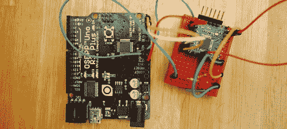

# 双核 Arduino 支持更多引脚

> 原文：<https://hackaday.com/2012/08/31/dual-core-arduino-for-more-pins/>

任何项目都有获得更多 I/O 引脚的简单方法；移位寄存器、I2C 扩展器或 ADC 将为您构思的任何项目提供大量引脚。然而，所有这些都需要额外的组件。进入[Arduino](http://authenticinvention.com/authentic/?p=304)的 ExtraCore 库，这是一个软件库，可以将两个或更多 Arduino 转变为一个多核微控制器，其引脚数量超过您的需求。

ExtraCore 库来自[Dustin Andrews]，允许任何人像控制单个 Arduino 一样轻松地控制两个 Arduino 的输入和输出引脚。

硬件设置相当简单——只需将两个 Arduinos 上的 A4、A5、电源和接地连接在一起。在第二台 Arduino 上安装“客户端”草图后，您可以修改“管理器”草图以适应您正在构建的任何项目。从那时起，您的项目可以控制的 Arduino 引脚数量几乎增加了一倍。

这可能不是两个 Arduinos 最实际的用途，但肯定令人印象深刻。你可以在 GitHub 上找到[Dustin]的代码[。](https://github.com/dustinandrews/ArduinoExtraCore)