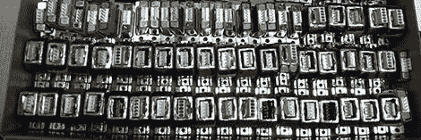

# 垃圾箱搜索网 100 Arduino 驱动的电机控制器

> 原文：<https://hackaday.com/2012/11/06/dumpster-diving-nets-100-arduino-powered-motor-controllers/>

从来没有人在工作中放弃回收堆，[斯科特]通常不会找到太多。几个旧硬盘，也许偶尔会有一台老式笔记本电脑，但在极少数情况下，他会发现一些真正有用的东西。最新的成果是一组步进电机驱动器，只需要一点点工作，就可以通过逆向工程变成 Arduino。

在撬开一个塑料封装的电路板后，[Scott]发现了一个 LED，一组为电机供电的晶体管，以及一个 ATMega168 微控制器。有趣的是，168 的大多数引脚已经在每个控制器的 DA15 连接器上断开。唯一需要的是构建一个程序员来将 Arduino 引导加载程序转储到这些小部件上。

经过多次试验和错误(并建立了一个新的编程接口)，[Scott]现在有 100 个内置了一个步进电机控制器的 Arduinos。他已经制作了一个玩具灯光循环，在一个小步进器上旋转(休息后)并闪烁 LED，但有了这么多小部件，我们想知道[斯科特]会想出什么疯狂的玩意儿。

[https://www.youtube.com/embed/kqDJ0wmGLCY?version=3&rel=1&showsearch=0&showinfo=1&iv_load_policy=1&fs=1&hl=en-US&autohide=2&wmode=transparent](https://www.youtube.com/embed/kqDJ0wmGLCY?version=3&rel=1&showsearch=0&showinfo=1&iv_load_policy=1&fs=1&hl=en-US&autohide=2&wmode=transparent)