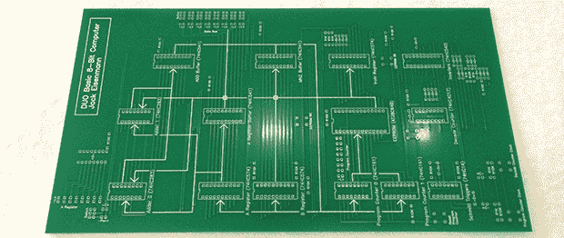

# Duo Basic:全逻辑芯片教育计算机

> 原文：<https://hackaday.com/2013/11/03/duo-basic-an-all-logic-chip-educational-computer/>

早在微型计算机出现之前，一些非常幸运的学生第一次接触了微型计算机训练器。这些简单的设备使用普通的逻辑芯片、灯和开关来执行计算；基本上，一个非常小和简单的计算机。[杰克]刚刚发布了他的[DUO 基本 8 位教育计算机](http://www.ostracodfiles.com/basic/menu.html)，这是一台完全围绕逻辑芯片设计的计算机，就像过去一样。

除了一个 EEPROM 之外，整个计算机有 256 字节的 ROM、三个寄存器和两条指令(条件 jmp 和 add)。这使得简单的程序可以通过扳动开关和点击按钮来编写——除此之外没有什么“裸机”了。

[Jack]有一个用于 DUO Basic 的在线汇编器和仿真器以及一些示例汇编程序。当然，所有的原理图和框图都可以在他的网站上找到，还有一个很好的介绍视频，如下所示。

[https://www.youtube.com/embed/qAJs0B5zWbQ?version=3&rel=1&showsearch=0&showinfo=1&iv_load_policy=1&fs=1&hl=en-US&autohide=2&wmode=transparent](https://www.youtube.com/embed/qAJs0B5zWbQ?version=3&rel=1&showsearch=0&showinfo=1&iv_load_policy=1&fs=1&hl=en-US&autohide=2&wmode=transparent)