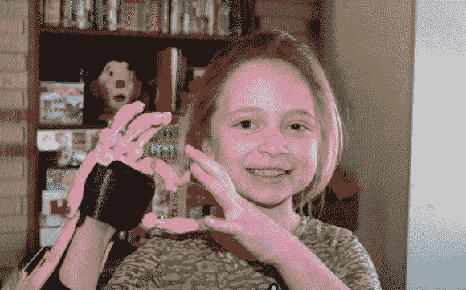
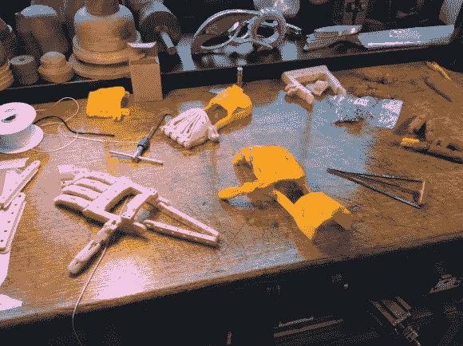

# 让谢伊能为自己造一只假手！

> 原文：<https://hackaday.com/2014/03/15/e-nableing-shea-to-build-a-prosthetic-hand-for-herself/>

今天有一个温暖人心的故事。介绍一下[Shea]，一个 9 岁的小女孩，她有一只来自网络陌生人社区的[假手！](http://www.jsonline.com/news/health/online-community-lends-a-hand-to-build-prosthesis-for-mukwonago-girl-b99205013z1-248250401.html?ipad=y)

她出生时只有右手手掌和一个两指大拇指——没有手指。尽管这个时代，假肢通常不是那么好，或者负担得起——特别是对于一个快速成长的年轻女孩。所以当[谢伊]在圣诞节前向圣诞老人要一只新手时，她的妈妈[雷尼]开始在网上做一些研究。她通过脸书的帖子看到了 3D 打印的义肢，并设法找到了一个名为的 E-Nable group，这是一个致力于伸出援手的创客社区——真的。

该小组让她联系上了[尼克·帕克]，一名来自加州的高中生和机器人爱好者，他渴望提供帮助，然后(在线)将她介绍给了他当地的创客空间——从那里他们联系上了密尔沃基创客空间(离家更近)，以及威斯康星大学密尔沃基分校的副教授[弗兰基·弗洛德]。

[Flood]立即开始工作，尽管他还没有为 little [Shea]在圣诞节前几天给的三天期限做好准备。他拿了一些已经可以在网上找到的设计，包括最初的[机器人手](http://www.robohand.net/)、[鹰爪手](https://www.thingiverse.com/thing:229620)和[半机械人野兽](http://enablingthefuture.org/tag/cyborg-beast/)并开始修补。

通过用谢伊最喜欢的颜色为手创造部件，他进一步完善了设计，越来越熟悉它的功能。今年 2 月，[谢伊]和她的家人访问了 UWM，尝试第一台样机。在穿上它的几秒钟内，[谢伊]就已经兴奋地拿起东西了！手通过使用手腕运动来张开和合拢手——目前这相对有限，但与没有手指相比，这对[谢伊]来说是一种惊人的新体验。

正如[Flood]所说:

> 看到她用新的手拿起东西让我兴奋不已，这是我经历过的最酷的感觉之一。

他们将继续与她一起完善和重新设计这只手，这只手也将在网上向所有人开放，被恰当地称为“谢伊的手”。这难道不会让你想出去帮助别人吗，比如她？

更多关于 E-Nable 和“谢伊之手”项目的信息可以在他们的博客上找到。