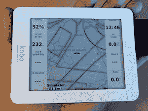

# 电子阅读器成为滑翔机和滑翔伞电脑

> 原文：<https://hackaday.com/2014/05/28/e-reader-becomes-sailplane-and-paraglider-computer/>

【Tweepy】驾驶无动力飞机，他想使用 XCSoar 飞行电脑应用程序来驾驶滑翔机、滑翔机和滑翔伞，但是找不到任何硬件。XCSoar 是一个令人惊叹的应用程序，可以跟踪地形、路线、热量和一系列其他变量，使飞行更加愉快，但在对悬挂式滑翔机飞行员有用的设备上运行它是一个挑战。

他最终在 Kobo mini 电子阅读器中找到了一个近乎完美的设备。它是电子墨水，所以它在阳光下可读，使用与手套兼容的电阻式触摸屏，运行安卓系统，而且非常便宜。唯一缺少的是一个全球定位系统接收器。该怎么办呢？ [Mod 一个电子阅读器，当然是](http://www.dotmana.com/weblog/2014/05/kobo-mini-gps-mod/)。

国防部的电子部分很简单；串行 GPS 单元几乎随处可见，Kobo 在板上有一个串行头。然而，这个箱子[需要一些东西](http://www.thingiverse.com/thing:183936)，完成的箱子模型看起来相当专业。

通过一些软件更新、新地图，当然还有惊人的 XCSoar 应用程序，【Tweepy】拥有了一台不到 100 欧元的超棒飞行电脑。唯一缺少的是一个集成的变倍计，但[一个游戏机将在必要时工作](http://hackaday.com/2005/10/02/gba-variometer/)。