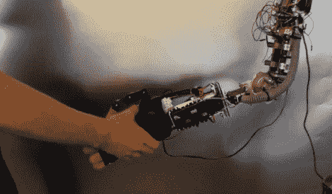

# [Easton 的]机械臂在国际科学与工程博览会上获得第二名

> 原文：<https://hackaday.com/2012/06/02/eastons-robot-arm-takes-2nd-place-in-the-international-science-and-engineering-fair/>

在这里，我们看到[伊斯顿·拉查佩尔]从他建造的机器人手臂那里得到了一个祝贺的握手。该项目旨在人类修复，我们很高兴地报告[Easton]在今年的国际科学与工程博览会上获得了机电工程组第二名( [PDF 列出了获奖者](http://www.societyforscience.org/document.doc?id=386))。

在视频中，他向我们展示了该项目的大致情况。自从我们[上次](http://hackaday.com/2011/08/29/eastons-animatronic-hand-gets-3d-printed-upgrade/)和他登记入住以来，他已经为手臂增加了一个可以安装的身体。手臂现在有肩部运动，使用齿轮传动的 DC 电机和一些电位计进行方向反馈。对于肘部，他想有同样的设置，但遇到了麻烦安装电位计。他的解决方案是使用一些 shapelock 来塑造一个支架(shapelock 是[你在水中融化形成任何形状的塑料](http://hackaday.com/2011/08/19/robotic-arm-and-claw-sculpted-entirely-from-shapelock/))。除了前面提到的关节，手腕、手指和手在支撑方式和性能上都有所改善。

我们认为这对任何人来说都是了不起的工作，尤其是一个 16 岁的高中生。干得好[伊斯顿]！

[https://www.youtube.com/embed/ppMuu1X08T8?version=3&rel=1&showsearch=0&showinfo=1&iv_load_policy=1&fs=1&hl=en-US&autohide=2&wmode=transparent](https://www.youtube.com/embed/ppMuu1X08T8?version=3&rel=1&showsearch=0&showinfo=1&iv_load_policy=1&fs=1&hl=en-US&autohide=2&wmode=transparent)