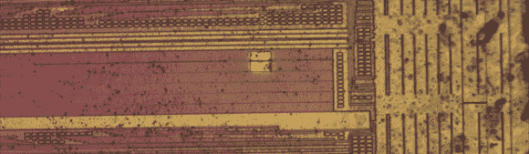

# 具有聚焦离子束的编辑电路

> 原文：<https://hackaday.com/2014/04/01/editing-circuits-with-focused-ion-beams/>

[Andrew]这学期一直在忙着开一门硬件逆向工程的课，他认为这门课的完美结局将是一件极具挑战性和令人惊讶的事情。为此，[他正在编辑电路](http://siliconexposed.blogspot.com/2014/03/getting-my-feet-wet-with-invasive.html)中的 CPLD，深入到 CPLD 的金属层并探测其内部的信号。这是逆向工程的基础工作，几乎每一块硅都被制造出来，也是对主要研究实验室和三字母机构实际上能做什么的一个很好的观察。

[Andrew]选择的芯片是 Xilinx XC2C32A，一种便宜但仍然现代的 CPLD。探测信号的第一步是将芯片从塑料容器中取出，在芯片上发现一些有趣的信号。在为芯片设计出合理的功能图后，他决定深入研究 ZIA 上的一条线路，即宏单元、GPIO 引脚和功能块之间的总线。

[实际探测这些信号中的一个](http://siliconexposed.blogspot.com/2014/03/getting-my-feet-wet-with-invasive_31.html)首先涉及铣透 900 nm 的氮化硅，以到达金属层和一条信号线。然后这个洞被铂填满，一个大的 20 微米的正方形被放下作为探针。经过几次尝试，Andrew 已经能够为芯片编写一个简单的“闪烁 LED”代码，并从这个测试点观察 s 方波。不多，但这是在定制 ASIC 上逆向工程加密的第一步，读取一些未记录的配置位，基本上用硅片做任何你想做的事情。

这不是任何人能在自己的实验室里做的事情。这不仅仅是手头有一台电子显微镜；[Andrew]轻而易举地用价值几百万美元的工具探测了这个芯片的内部。不过，这是一个非常酷的研究，看看大男孩用正确的设备可以做什么。