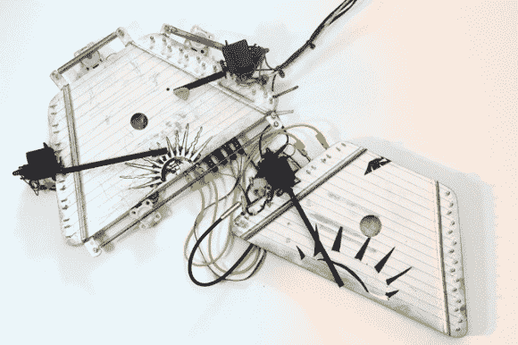

# 怪异的机器人仪器使用伺服系统和螺线管

> 原文：<https://hackaday.com/2014/05/15/eerie-robotic-instruments-make-use-of-servos-and-solenoids/>

自动钢琴已经过时了。一个机器人声学 gusli 怎么样？

[Dmitry Morozov]称之为 Turbo-Gusli 或 Gusli-Samogudy。古斯里琴可能是最古老的俄罗斯多弦乐器，类似于竖琴，其确切历史不太为人所知。在名字上加上 Samogudy，你就有了一个“自我发挥的 Gusli”。

这种怪异的音乐是由六个单独的伺服电机、一个常规的 DC 电机、一个步进电机、三个螺线管、一些弹簧和 38 根琴弦产生的。全部由两个 Arduino Unos 控制，软件用[纯数据](http://puredata.info/index.html)开源可视化编程语言编写。

他为展览制作了几个视频，包括一个让我们不寒而栗的表演——休息后留下来听一听！

[https://player.vimeo.com/video/94952880](https://player.vimeo.com/video/94952880)[https://player.vimeo.com/video/94959912](https://player.vimeo.com/video/94959912)[https://player.vimeo.com/video/94968198](https://player.vimeo.com/video/94968198)

作为一名艺术家制作人，[Dmitry]制作了不少有价值的工具，比如他的干冰[低温电话](http://hackaday.com/2013/12/17/cryophone-a-dry-ice-powered-musical-installation/)，或者我们最喜欢的——名为[金融风险的信用卡刷卡展览。](http://hackaday.com/2013/08/13/just-swipe-your-card-and-enter-the-pin-what-could-go-wrong/)