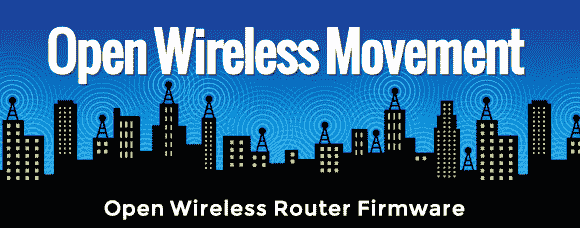

# EFF 推出开放式路由器固件

> 原文：<https://hackaday.com/2014/07/21/eff-launches-open-router-firmware/>

电子前沿基金会发布了他们自己的[开放无线路由器固件](https://www.eff.org/deeplinks/2014/07/building-open-wireless-router)的 alpha 版本，作为[开放无线运动](https://openwireless.org/)的一部分。该项目旨在使与其他人共享您的无线网络变得更加容易，同时保持流量的安全性和优先级。

我们已经看到了很多基于替代路由器固件的黑客攻击，比如这个[独立网络电台](http://hackaday.com/2013/01/08/turning-a-tiny-router-into-a-webradio/)。EFF 基于 [CeroWRT](https://www.bufferbloat.net/projects/cerowrt) 的路由器固件，这是众多开源固件选项之一。目前，固件包仅针对 Netgear WNDR3800。

许多路由器都有访客模式，但是它们非常有限，并且经常有严重的漏洞。如果你对共享你的无线网络感兴趣，这个固件可以帮助你共享一定量的带宽。它还旨在拥有一个安全的网络界面，并使用 Tor 进行安全的自动更新。

EFF 已经宣布了这个“前阿尔法黑客发布”,作为对想要加入乐趣的黑客的呼吁。开发正在 Github 上进行，在这里你可以找到所有的源代码和问题。