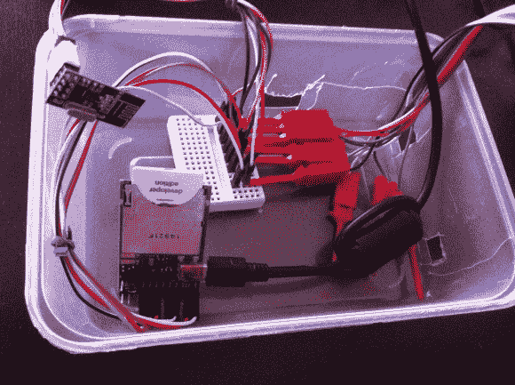

# 作为互联网至射频网关的电气 Imp

> 原文：<https://hackaday.com/2013/07/25/electric-imp-as-an-internet-to-rf-gateway/>

这个项目是一项关于连接几个不同家庭的电子硬件的研究。上图展示了事物电动的一面。它[将其互联网连接与项目其余部分的射频连接](http://arduino-for-beginners.blogspot.com/2013/06/electric-imp-arduino-nrf24l01-fully.html)连接起来。

小鬼是一个奇特的(耐人寻味？)一块硬件。看看[Brian bench off][对 SD 外形硬件的亲身体验](http://hackaday.com/2012/09/04/hands-on-with-the-electric-imp)，它根本不是 SD 卡。这是一个嵌入式系统，它使用轻量级编程和基于云的软件设置来为您的项目带来无线互联网。

在这种情况下，[Stanley Seow]开始想知道他是否需要多个 Imps 来连接他的设置的不同部分。有点挠头导致他使用 nRF24L01 模块，这是便宜且易于使用的射频收发器板。他拿了一个部分完成的驱动程序项目，并把它带回家和 Imp 一起玩。现在，他可以使用该系统与其他组件进行通信，这些组件最终将用于家庭自动化。目前，他的概念验证向驱动发光二极管的 Arduino 发出无线命令。