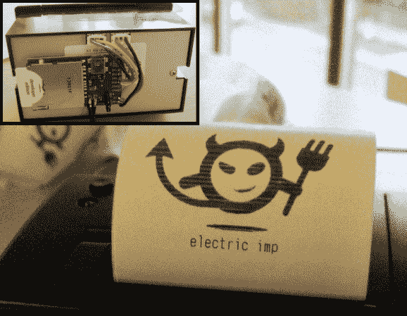

# 电动热敏打印机

> 原文：<https://hackaday.com/2014/01/25/electric-imp-thermal-printer/>

如果你是那种不介意口袋/钱包里装满皱巴巴的收据的人，那么也许你应该看看这个来自[tombrew]的关于给一台[热敏打印机提供互联网连接](http://www.instructables.com/id/imPrinter-the-electric-imp-wireless-internet-conne/)的教程。

对于我们中的一些人来说，热敏打印机有一些很酷的东西，但它可能不是你想要燃烧大量卡路里的那种项目。作为 Electric Imp 的一名开发人员，[tombrew]同意这种说法，但由于 Electric Imp 包含一个 [WiFi 模块和内置于](http://hackaday.com/2012/05/17/electric-imp-connects-projects-to-the-internet/)的处理器，它可以很容易地让你的热敏打印机打印出每日天气、股票价格、新闻标题等。事实上，这里的说法是，你甚至可以在喝完早晨的咖啡之前完成这个项目……*敲敲木头！*

从硬件的角度来看，这个项目非常简单；一个带有分线板、热敏打印机和电源的电动 Imp 几乎是所有需要的东西。电动 Imp 和热敏打印机之间的本地通信通过简单的串行接口完成。几个月前，随着新型电动汽车的推出，我们被介绍给了“代理商”。这是一个不错的概念，本教程将所有内容进行了分解，但基本上，代理是运行在“ImpCloud”中的服务器端代码，从而为您的电子 Imp 提供更多处理复杂 API 的能力。此外，处理图像(比如您想要打印的东西)会占用大量内存，因此对于这个项目，代理用于发送您想要一次打印一张的图像切片。这个项目仅仅是[tombrew]计划的开始，所以我们迫不及待地想看到更多疯狂详细的教程。