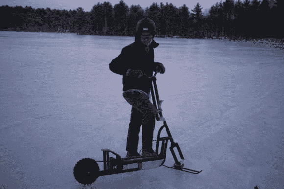

# 电动滑板车 MK 1 —苔原升级！

> 原文：<https://hackaday.com/2014/03/26/electric-scooter-mk-1-tundra-upgrade/>

在发现他的全地形雪地滑板车在冰上很糟糕之后——[Dane]决定他需要做一些升级。

如果你不记得，我们第一次分享[【Dane 的】项目是在 12 月](http://hackaday.com/2013/12/30/electric-snow-scooter/)，他在白雪覆盖的城市街道上飞驰。滑板车使用一个大的多节轮胎和一个前滑板来滑行。为了使它适用于冰上，他不得不稍微重新设计它以适应光滑的表面；他需要给它穿上冰鞋。

他原本希望在旧货店找到花样滑冰鞋(他最初在那里找到了经典的滑板车)，但没有运气——所以他自己做了一个。一些 1/2 英寸 x 1/4 英寸的钢筋，一点焊接，他有一个相当坚固的前滑板工作！

在他对升级后的前端感到满意后，他开始在后轮胎上加饰钉。他使用普通的老式 3/8”自攻螺钉，并使用大量环氧树脂来确保它们不会脱落。

那么这有用吗？哦是的。

[https://player.vimeo.com/video/89869097](https://player.vimeo.com/video/89869097)[https://player.vimeo.com/video/89267911](https://player.vimeo.com/video/89267911)