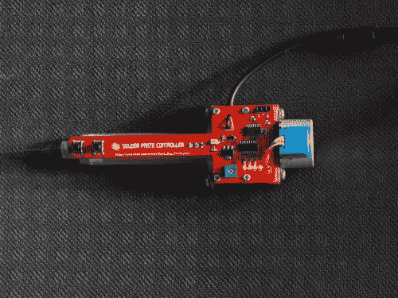

# 电动锡膏分配器加快回流准备

> 原文：<https://hackaday.com/2014/07/05/electric-solder-paste-dispenser-speeds-up-reflow-prep/>

让我们制造机器人的[Geir Andersen]已经越来越深入地探索表面贴装器件的奇妙世界，如你所知，这种器件很难焊接！不想花几百美元买一台专业的锡膏分配器(和空气压缩机)，[Geir]决定自己制造一台。

它允许他使用标准的焊膏注射器，使用这种技术可以很容易地重新填充焊膏。专业的分配器使用空气压力来控制糊状物的流动，但是[Geir]决定走全电动路线。他将一个小型步进电机连接到一个螺纹轴上，这个螺纹轴可以推动活塞上下移动注射器。

再加上几个 3D 打印的外壳零件，一个设计精美的 PCB，你就有了一个超级方便的锡膏分配器！他甚至在电路板上安装了一个小电位计来改变电机的速度。它可能不像专业的那样准确，但正如你在休息后的视频中看到的那样，它似乎对[盖尔的]目的非常有用。

[https://www.youtube.com/embed/46Gd3RvWFgE?version=3&rel=1&showsearch=0&showinfo=1&iv_load_policy=1&fs=1&hl=en-US&autohide=2&wmode=transparent](https://www.youtube.com/embed/46Gd3RvWFgE?version=3&rel=1&showsearch=0&showinfo=1&iv_load_policy=1&fs=1&hl=en-US&autohide=2&wmode=transparent)

【谢谢 Jan！]