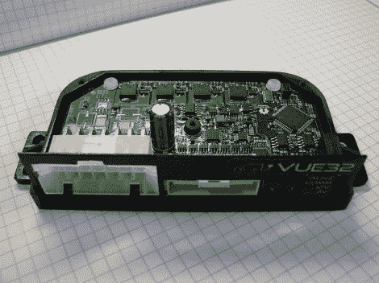

# 面向大众的电动汽车外围控制器

> 原文：<https://hackaday.com/2012/10/12/electric-vehicle-peripheral-controller-for-the-masses/>

这块多汁的印刷电路是一个用于电动汽车外围设备的开源控制器。这是一个致力于城市通勤车辆的顶点项目的产品。没有合适的非专有模块来控制汽车的外围设备，所以团队自己开发了一个。

据我们所知，这是不负责驾驶车辆本身。我们假设有另一个硬件读取油门踏板，相应地驱动电机，并处理再生制动等事情。但是现代汽车中还有很多其他的东西需要注意。必须切换车头、车尾和转向指示灯。所有的仪表板控制(如转向信号杆和雨刮片速度设置)都需要监控。需要一些东西来驱动门锁，并且必须处理一个读取门半开传感器和开关顶灯的系统。这是上图控制器真正闪光的地方。

团队已经发布了所有的硬件信息。代码现在还不可用，但是一旦他们清理好足够的代码来打包第一个候选版本，就可以了。