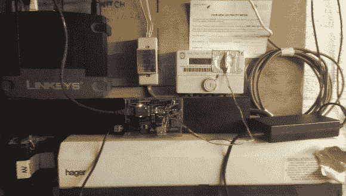
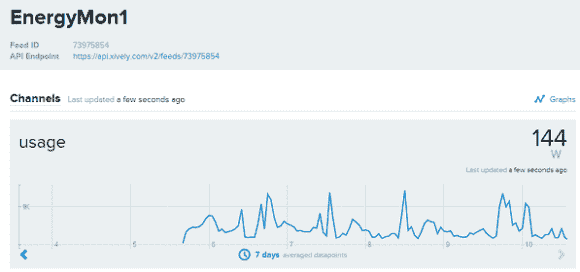

# 用光电传感器、MQTT 和一些胶带进行电力监控

> 原文：<https://hackaday.com/2014/08/01/electricity-monitoring-with-a-light-to-voltage-sensor-mqtt-and-some-duct-tape/>

当涉及到能源管理时，拥有实时数据是关键。但公用事业公司很少免费发布最新的千瓦时信息，这使得在计费周期内调整消费习惯极其困难。所以当我们听说[Jon]的[项目是翻译从他的仪表](http://jonarcher.info/2014/03/arduino-based-electricity-monitor/)发出的光信号时，我们必须去核实一下。

从外观上看，他的硬件配置比较简单。它使用的是一个 TSL261 光电压传感器，连接到一个带有以太网屏蔽的 Arduino。然后将传感器贴在电表闪烁的 LED 上方，每当发出脉冲指示每用一瓦特电时，LED 就会闪烁。他的配置特定于他的公用事业公司安装的电表类型，并且不能保证该公司部署的所有电表都是相同的。但这是迈向更好的能源监控解决方案的良好开端。

整个过程都记录在[Jon]的网站上，让更多对能源感兴趣的人可以看到这一切是如何实现的。在这篇文章中，他描述了如何开始使用 MQTT，这是一种[机器对机器(M2M)/“物联网”连接协议，](http://mqtt.org/)用于产生实时图形，从实时馈送中传输数据。

现在，有了这些有价值的信息，就可以在此基础上构建其他应用程序了。与类似于 [Pinoccio 微控制器系统](http://hackaday.com/2014/07/15/pinoccio-mesh-all-the-internet-of-things/)的接口可以允许设备在峰值功率期间关闭，有助于降低月底的计费价格。

像这样的能源智能平台有助于节约用电，同时让纳税人始终了解他们的用电习惯。真正的胜利，胜利。然而，我们仍然需要弄清楚如何(合法地)从其他类型的电表中提取数据。

一个例子是[用一个特殊的 USB 加密狗](http://hackaday.com/2012/04/09/harvesting-and-graphing-wireless-household-utility-meter-info/)无线收集信息，以收集从电表发出的数据。但是这只对那个牌子的米有效。另一个解决方案是[用一个 AVR、一个电阻、一个电容和一个光电晶体管读取红外闪光](http://hackaday.com/2011/05/13/monitor-your-homes-power-usage-on-the-cheap/)，这类似于上面【乔恩】创造的。

那么，你有什么样的仪表？您认为有更好的方法来提取电量数据吗？请在评论中告诉我们，让我们看看我们能想出什么。