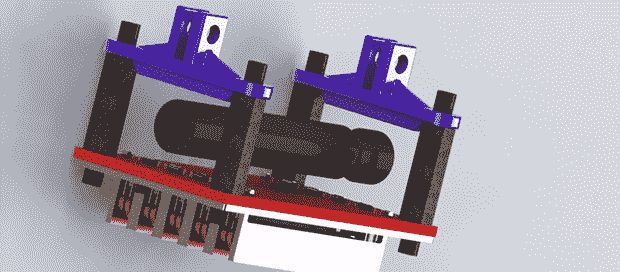

# 四轴飞行器的电永磁体

> 原文：<https://hackaday.com/2013/07/12/electro-permanent-magnets-for-quadcopters/>

想象一架四轴飞行器悬停在有效载荷上方——或许是一罐豆子。直升机下降到有效载荷上，启动电磁铁，带着流浪汉的晚餐飞走了。现在，这有点不可能。一个如此强大的普通电磁铁会消耗惊人的能量，这是四轴飞行器通常不具备的。有了 OpenGrab 项目，由于一些非常聪明的磁学应用，遥控空中起重机的梦想触手可及。

OpenGrab 背后的技术是一个[电永磁体](http://en.wikipedia.org/wiki/Electro-permanent_magnet)，基本上是一个电磁体，你可以打开和关闭，但不需要任何电源来保持打开。OpenGrab 受到了[一篇旨在使用这些设备进行自我组装建筑的博士论文](http://www.hizook.com/blog/2010/12/07/electropermanent-magnets-programmable-magnets-zero-static-power-consumption-enable-s)的极大影响。

这个项目在 Kickstarter 上开展了非常成功的活动，并取得了很大的进展。虽然啤酒不再装在钢罐里，但我们可以想象这种技术有很多非常酷的应用，从令人恼火的电子谜题到一些非常酷的遥感应用。