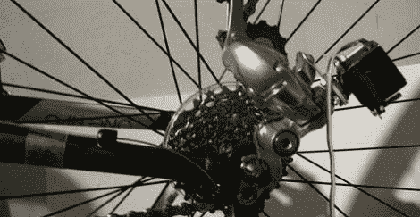

# 电动自行车变速器

> 原文：<https://hackaday.com/2012/06/06/electronic-bike-derailleur/>

[Nabil]送来了一个很棒的电动自行车变速器。现在，[Nabil]可以用电子方式换挡，而不是用换挡机构拉动钢缆。作为奖励，变速器可以由一个小型自行车电脑控制，所以他总是在正确的齿轮。

新的电子拨链器由一对伺服系统控制，手柄杆上有按钮。这使得[Nabil]可以自动修剪链条，完全消除链条摩擦。

这个电子移位器是[Nabil]更大的自行车电脑项目的一部分。除了电子控制自行车的档位之外，[Nabil]还将增加一个全球定位系统，加速计，高度计，心率监测器和脉搏血氧计。这是一个令人印象深刻的套件，我们迫不及待地想看到整个项目完成。你可以在 GitHub 上找到当前版本的设计[，并在](https://github.com/nabilt/diy_eshift)[【纳比勒】的博客](http://nabilt.github.com/diy_eshift/)上关注所有更新。