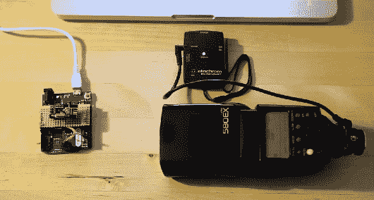

# Arduino 触发的 Elinchrom EL-Skyport

> 原文：<https://hackaday.com/2013/12/27/elinchrom-el-skyport-triggered-by-arduino/>

[Toby]有一个 Elinchrom EL-Skyport，这是一个无线闪光触发器。他决定试试能否用 Arduino 触发它，于是[想出了一个不错的概念证明](http://infar.be/index.php?/archives/1005-Elinchrom-EL-Skyport-triggered-by-Arduino.html)。这个小装置并不意味着用户可维修，这可以从[托比]拆开它时发现的东西[中看出。但是一旦他把它拆开，他就把里面的所有东西分类，然后他令人敬畏地去找麻烦](http://infar.be/index.php?/archives/982-Elinchrom-EL-Skyport-Transmitter-Opening,-design,-schematics.html)[画了一张示意图](http://infar.be/media/pix/Elinchrom_EL-Skyport_TX_Schematic_V1.0.pdf)。有了这些知识，他开始对使用的 SPI 协议进行逆向工程。

这是一条漫长的道路，但最终[托比]建造了一个原型 Arduino 盾牌，里面有一个 nRF24L01+模块。在易贝买这些东西非常便宜。他给了我们连接模块的细节，尽管因为他使用 Arduino Leonardo，他不得不通过额外的关卡。尽管如此，一旦你启动并运行了，你可以使用一个现有的 [库](http://playground.arduino.cc/InterfacingWithHardware/Nrf24L01)专门用于这个模块。

多亏了他的努力，我们其他人又多了一个可以入侵的设备。谢谢[托比]！

[https://player.vimeo.com/video/82454049](https://player.vimeo.com/video/82454049)