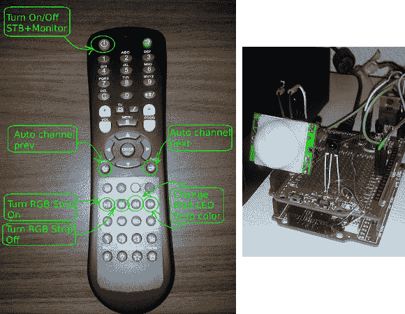

# 为您的家庭娱乐设备雄辩通用接收器

> 原文：<https://hackaday.com/2013/03/14/eloquent-universal-receiver-for-your-home-entertainment-equipment/>

我们真的开始享受家庭娱乐控制黑客，它使用一个通用的接收器来处理来自任何遥控器的命令。这款特别有趣，因为它使用一个遥控器来控制系统，但加入了许多额外的功能。

看着接收器本身，PIR 传感器的白色塑料圆顶应该会令人侧目。由于打开有线电视盒需要一段时间，所以当你走进房间时，[Ivan]包含了运动传感器来打开该组件。这样，当你坐下的时候，它就准备好了。它通过从 PIC32 开发板发送 IR 信号来实现这一点。当然，电路板有自己的接收器来监听遥控命令。远程按钮的映射与最初的设计略有不同。你可以在上图中看到，普通的 VCR/DVD/DVR 按钮被设置为控制房间的 LED 灯条。该项目甚至还集成了一个功耗监控器。所有这些功能都在休息后的片段中进行了演示。

这是一个近乎完美的基础设置。但是我们希望在未来的某个时候看到它拥有网络界面。

[https://www.youtube.com/embed/xUDWwZYPEx8?version=3&rel=1&showsearch=0&showinfo=1&iv_load_policy=1&fs=1&hl=en-US&autohide=2&wmode=transparent](https://www.youtube.com/embed/xUDWwZYPEx8?version=3&rel=1&showsearch=0&showinfo=1&iv_load_policy=1&fs=1&hl=en-US&autohide=2&wmode=transparent)