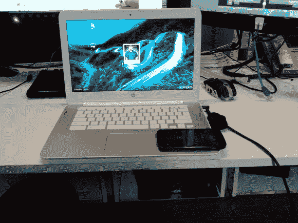

# 将无线充电嵌入您的笔记本电脑

> 原文：<https://hackaday.com/2014/07/12/embedding-wireless-charging-into-your-laptop/>

寻找项目做[杰森·克拉克]认为在他的惠普 Chromebook 14 中集成一个备用无线 [Qi 充电器可能会很有趣。](http://www.cyborgworkshop.org/2014/07/11/embed-a-qi-charger-in-an-hp-chromebook-14/)

他首先打开 Qi 充电器——它是通过粘合剂和藏在脚垫下的四个十字螺丝固定在一起的——总之，并不难做到。一旦塑料脱落，电路和线圈实际上相当小，这使它成为侵入各种东西的理想选择。我们已经看到他们把[塞进了 Nook 的](http://hackaday.com/2014/06/10/stuff-wireless-charging-into-a-nooks-crannies/)、[一颗心脏](http://hackaday.com/2014/02/28/wireless-charging-have-a-heart/)，为[的电话窃听而回收…](http://hackaday.com/2014/06/09/hacking-a-magsafe-connector-for-your-iphone/)

无论如何，下一步是打开 Chromebook。Qi 充电器需要 2A 的 5V 电压才能工作，幸运的是，这是 USB 3.0 规范 Chromebook 中有两个端口。他确定了电路板上的 5V 电源，并直接焊接在电线上——让电源存在！

虽然线圈和电路板相当小，但 Chromebook 的外壳下没有太多空间，所以[Jason]延长了线圈导线，并将其单独放置在键盘下方。他关上所有的东西，交叉手指，打开电源。成功！

用 RFID 阅读器做类似的事情会很酷——这样你就可以锁定你的笔记本电脑，除非你带着你的 RFID 戒指！