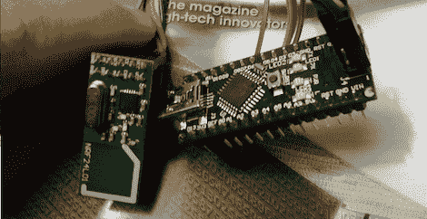

# 用 Arduino 模拟学生点击器

> 原文：<https://hackaday.com/2012/11/16/emulating-a-student-clicker-with-an-arduino/>

当学校和大学有数百名学生参加讲座课程时，他们需要一种方式来告诉校友和其他潜在的捐助者，师生关系与 20 世纪 60 年代一样好，当时的入学率只是当前水平的一小部分。显然，技术解决了所有问题，所以这些大学的管理者转向了“点击器”——用于考勤和管理测验的无线电频率遥控器。这些点击器完全没有安全性，所以毫不奇怪[Taylor Killian]能够用 Arduino 模拟这些点击器中的一个,允许任何拥有笔记本电脑的人在测验中作弊，或者让整个班级只有一个学生在场。

前情提要[Travis Goodspeed](感谢你发来这篇文章，[Travis])拆开了其中一个点击器——一个 turning point response card RF——发现它使用了一个北欧 nRF24L01 无线收发器，在易贝通常只需两美元。

[Taylor]将这个无线模块连接到一个 Arduino 上，并快速编写了一些代码，允许他听取观众的反应，以单个点击者或所有点击者的形式回答问题，自动回答最受欢迎的答案，甚至阻止所有观众对每个问题的反应。

也许技术不能解决所有问题，但至少[泰勒]从书店以疯狂的价格出售的一个美化了的遥控器中学到了一些东西*。*