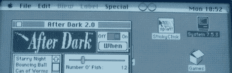

# 在 Android 设备上模拟 Mac 系统 7

> 原文：<https://hackaday.com/2012/06/18/emulating-mac-system-7-on-an-android-device/>

在 68kmla forums，一个致力于 1994 年以前的旧 Mac 的网站上，[zydeco]发布了他的 T2 迷你 vMac 的 Android 端口，这是一个 Macintosh Plus 仿真器，可以在任何计算机上使用摩托罗拉 MC68000 处理器和系统 7。

不像最初的 Macintosh，也不像后来将内存提升到 512*千*字节的版本，Mac Plus 实际上很有用。通过增加一个 SCSI 端口和对 4 兆内存的支持，它不仅可以浏览互联网，还可以充当服务器。[Sprite_tm]选择重建这些经典的[一体机作为家庭服务器](http://hackaday.com/2010/11/04/mac-se-reborn-as-a-server-and-mac-emulator/)是有原因的；它们确实是更文明时代的优雅电脑的缩影。

68kmla 用户[flying aster]甚至在他的 nook touch 里放了一个 Mac Plus。这样，他就有了一个在电子墨水屏幕上运行的完整的系统 7 安装，包括*旅鼠*、*铁手套*和*俄罗斯方块。*

应该可以把这个仿真盒子接入互联网。不幸的是，经验告诉我们，在 [Hackaday 的复古版](http://retro.hackaday.com/)之外，不会有很愉快的浏览体验。