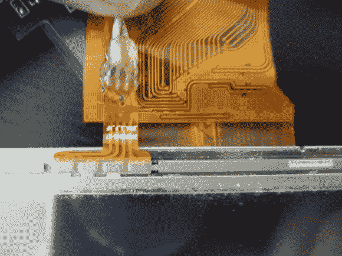

# 在消费者 LCD 上启用未使用的触摸屏覆盖

> 原文：<https://hackaday.com/2013/03/15/enabling-an-unused-touchscreen-overlay-on-a-consumer-lcd/>

当[Andrei]第一次得到他的 Raspberry Pi 时，他想马上让它成为一台独立的计算机。这意味着正常的输入设备，如鼠标和键盘，但也有一些类型的显示器。为了避免等待发货，他最终使用了当地大盒子商店的廉价车载备用摄像头屏幕。它工作得很好，最近他决定尝试将其转换为 5V 电源，以简化他的设置。在窥探设备内部时，他发现了一个未使用的电阻触摸覆盖层，并想出了如何让它工作的方法。

让他警觉的是那个没有连接任何东西的小型四导线连接器。他小心翼翼地将电线焊接到柔性电路上，然后在上面涂上热胶，以防止移动破坏刚性连接。为了让这个工作，你需要测量导体之间的电阻。大多数时候，我们认为可以直接使用 RPi GPIO 头，但是对于这个任务，需要一个中介。[Andrei]带了一个小的 Arduino 克隆板。只需要一点点的尝试和错误，就可以得到正确的连接，并找出将值转换成坐标的代码。