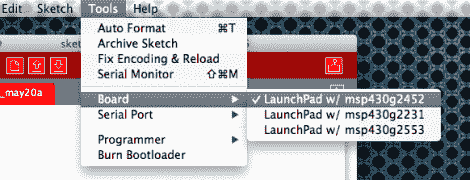

# Energia 将 Arduino IDE 引入 TI Launchpad

> 原文：<https://hackaday.com/2012/07/12/energia-brings-arduino-ide-to-the-ti-launchpad/>

Arduino IDE 是 AVR 芯片的一个抽象层，开发板就基于它。所以毫不奇怪，现在有可能使用带有 TI Launchpad 板的 Arduino IDE。这使得初学者可以非常轻松地使用廉价的低功耗 MSP430 平台。这都要归功于 Energia 开发人员的大量辛勤工作。

该项目从 Arduino 分支，所以外观，感觉和功能都是一样的。最值得注意的是，配色方案已经迁移到红色，以匹配启动板的颜色。通过选择 COM 端口和目标板，您可以用同样的方式配置硬件。几乎所有的东西都已经在工作了，但是你应该检查一下[已知问题页面](https://github.com/energia/Energia/wiki/Know-Issues)，这样你就不会试图使用一个没有被移植的函数。现在这个列表包括 random 和 random seed 函数，以及 tone、notone 和 micros。analogWrite 也有一个问题；它只会产生所需频率的一半，占空比只能设置在 0-50%之间。不过，如果您最喜欢在这个 IDE 中工作，这仍然是一个很大的进步。