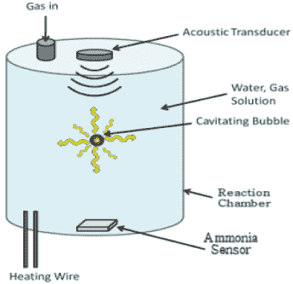
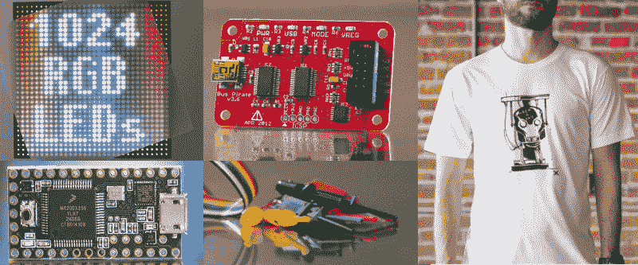

# 最佳环境相关奖项目

> 原文：<https://hackaday.com/2015/03/31/environment-related-prize-projects/>

上周[我们邀请你](http://hackaday.com/2015/03/24/time-for-the-prize-environment-related-ideas/)为[发布你关于 2015 年黑客日奖](http://hackaday.io/prize)的环境相关解决方案的想法。我们已经仔细检查了所有参赛作品，选出了本周的获胜者。这是一个多么艰难的过程，有如此多有趣的想法需要考虑，我们已经对一些引起我们注意的想法进行了总结。

Bosch Haber Process

## 节能

环保是这些项目的核心，彼得·沃什正在考虑大规模改进博世-哈伯流程。这一过程被用作肥料的氮源，消耗全世界 1%的能源。即使很小的效率提升也会产生巨大的影响。

从深奥到异想天开，[TomaCzar]有一个令人担忧的解决方案让灯亮着。我们喜欢他的序言，关于他的家人从一个拥有无限能量的星球搬到地球(因此他们习惯不关灯)。他计划给任何打开超过 10 分钟的灯增加一个声音警报。

## 能源生产

那些巨大的太阳能发电场使用镜子阵列将太阳光聚焦到一个中心塔上，利用了一种叫做集中太阳能的技术。传统上，它们将热量储存在液态盐池中，以便全天候发电。[PUNiSH3R]有一个小规模建造自己的计划。便携式微型热电联产将使用类似的概念(更少的熔盐),包装小到足以由一个人运输。

当启动电网时，这个星球上的不发达地区面临着巨大的问题。[希克斯]认为软式飞艇可能是缓解问题的一种方法。“破晓者”项目将软式飞艇拴在地面上，通过电解供应氢气使其漂浮。在高空中，它们可以利用涡轮机捕捉更高的风，并利用相同的系绳将电力传输回地面。

能源生产的另一个例子是家用地热斯特林发电机组。我们已经看到地热系统使用热交换器来加热或冷却你的家。[Shrad]考虑也使用循环流体回路来供给斯特林发动机的想法，这可以帮助为家庭供电。

## 很棒的想法

Is this parking lot a power plant waiting to happen?

有许多有趣的概念，我们认为非常值得考虑和讨论。很难说这些是否都是可行的，但讨论这些想法只是那种可能导致重大突破的互动。例如，这里看到的图像是一个新铺设和油漆的沥青停车场。[沥青集热](http://hackaday.io/project/4933-asphalt-heat-harvesting)设想通过在路面各层之间嵌入金属网络来大规模利用珀耳帖效应。表面和基层之间的温差会产生电流。

我们很难理解[开源模块化吸收式制冷机组](http://hackaday.io/project/4844-open-source-modular-absorption-refrigeration-unit)实际上是如何工作的。它试图用热源代替电力来提供制冷。图表看起来很有希望，我们认为 OSMARU 是一个可靠的缩写！

还记得 [*猎杀红色十月*](https://www.youtube.com/watch?v=jr0JaXfKj68) 吗？如果是这样的话，你一定还记得使潜艇几乎无声的履带驱动。猴子们想把它和海水用作发电机，而不是机车设备。[查看尺蠖项目](http://hackaday.io/project/4757-project-inchworm)。

## 本周的获胜者

**本周第一名**前往[改进博世-哈伯工艺](http://hackaday.io/project/4689-improve-the-bosch-haber-process)并将获得 [SmartMatrix 32×32 RGB LED 矩阵](http://store.hackaday.com/products/smartmatrix-bundle)以及一辆 [Teensy 3.1](http://store.hackaday.com/products/teensy-3-1) 来驾驶它。

**本周第二名**前往 [DayBreaker](http://hackaday.io/project/4920-daybreaker) ，将获得[一辆公交车盗版及探测电缆](http://store.hackaday.com/products/buspirate-v3-6-thm180c4m)。

**第三名**本周前往[家用地热斯特林发电机组](http://hackaday.io/project/4909-domestic-geothermal-stirling-power-unit)，将获得一个 Hackaday [机器人头部球座](http://store.hackaday.com/products/robot-head-tee)。

恭喜三位！我们认为值得一提的是，我们是根据其解决影响广泛人群的问题的能力、创新水平和概念的可行性来评判这个想法的。此时不需要构建任何东西或完成文档。不要害怕写下你自己的头脑风暴…它可能会为你赢得一个奖项！

## 下周的主题

今天晚些时候，我们会宣布下周的主题。不要让这阻止你输入参赛作品可能激发的任何想法。

本周的主题是就地老龄化。[查看公告](http://hackaday.com/2015/03/31/time-for-the-prize-aging-in-place/)帖子了解详情。

想出这个杀手概念需要用不同的方式思考，并与其他黑客、设计师和工程师互动，以帮助实现精神飞跃！

* * *

#### 2015 年[黑客日奖](http://hackaday.io/prize)由以下机构赞助:

