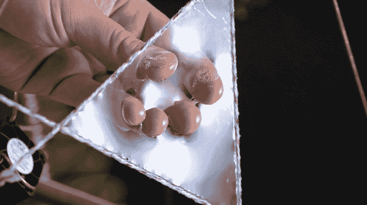
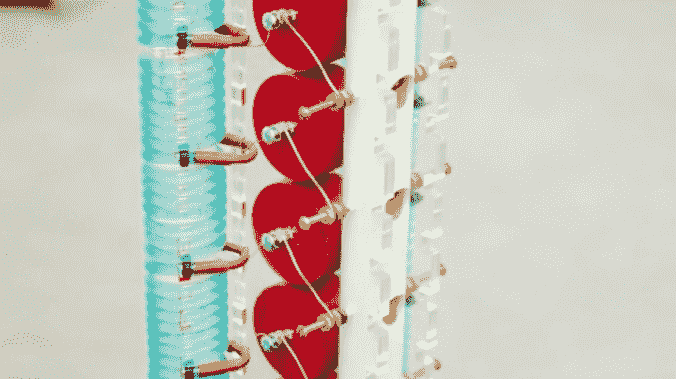

# 巧妙发明的短暂照片

> 原文：<https://hackaday.com/2014/12/08/ephemeral-photographs-staged-with-artful-inventions/>

作为一名摄影师，戈登·柯克伍德·丹尼尔的重点是捕捉短暂的现象，也就是说，那些看起来令人兴奋但又转瞬即逝的事物。为了记录在自然世界中发现的这种美丽的瞬间，他通过技术手段设计了它们发生的环境。

他为了帮助摄影而建造的令人惊叹的机械作品之一是一个大型电脑控制的吹泡机。几个步进电机工作，以 120 度角扩张三段浸泡肥皂的绳子，形成一个三角形的孔。当开口关闭时，这些部分稍微重叠，覆盖上一层一致的泡沫。当片段伸展开来时，一个风扇向中心吹一股气流，将流体鞘推入巨大的闪闪发光的球体中，他在一些照片中用这些球体作为焦点。

最近，[戈登]一直在开发一系列工作，包括用他发明的便携式电弧产生装置用 25 万伏电击植物主题，并用超低科技相机(就是那种曝光电影时藏在下面的风箱和床单)捕捉反应。使用一种他自己的方法，记录在大幅面胶片上的照片据称比现在使用的任何数码相机都更清晰。[Gordon]发起了一项群众筹资活动，支持[去雄伟的夏威夷岛](https://www.kickstarter.com/projects/557600777/electrified-flowers-of-hawaii?ref=card)朝圣，在那里，他将在十种不同的热带植物标本上使用他的闪电产生装置，这样他就可以用他久经考验的技术记录结果。(见下面一张他的闪电召唤师的艺术照)

有时候，Kickstarter 与其说是商业主义，不如说是开始与世界对话，开始个人冒险。愿这个旅程带来新的发明和更大、更雄心勃勃的项目！哦，对了——吹泡泡机是一个必看的活动。酷毙了:

[https://www.youtube.com/embed/WSx7CmZ85yY?version=3&rel=1&showsearch=0&showinfo=1&iv_load_policy=1&fs=1&hl=en-US&autohide=2&wmode=transparent](https://www.youtube.com/embed/WSx7CmZ85yY?version=3&rel=1&showsearch=0&showinfo=1&iv_load_policy=1&fs=1&hl=en-US&autohide=2&wmode=transparent)