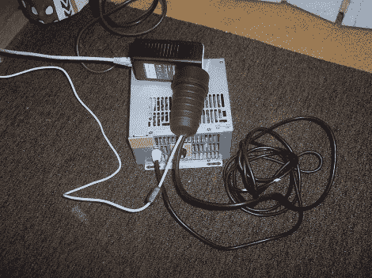

# 电话线上的以太网

> 原文：<https://hackaday.com/2012/04/18/ethernet-over-telephone-wire/>

当[bobo 11]将他的互联网连接从 ADSL 升级到光纤时，他遇到了一个问题，即如何通过他的局域网设置让他的台式电脑达到那个速度。在此之前，他一直使用一根电话延长线，从 DSL 进入房间的地方，通过一个分路器，连接到调制解调器所在的计算机。现在，光纤系统使用的路由器位于入口点，他没有简单的方法将以太网电缆连接到他的计算机房。可以预见的是，Wifi 比 50 兆位的广域网连接要慢，而且他不能直接使用电话线作为以太网。

解决方案是一对 TP-Link 家用插头适配器。这些都是专为使用你家的主线路进行数据传输而设计的。但是[Bob]把它组装起来，这样他们就可以通过电话线以 224 兆比特/秒的速度传输。由于您无法通过电话线运行电源电压，他不得不设法将设备的电源与数据 I/O 分离。这是通过外部电源和一些无源滤波组件实现的。缺点是这是半双工的，因此上行/下行通信不能同时发生。