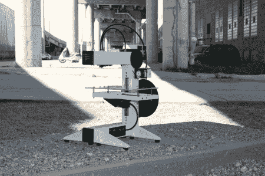

# eventurbot 3d 打印机

> 原文：<https://hackaday.com/2012/09/09/eventorbot-3d-printer/>

厌倦了使用 t 型槽结构的 3D 打印机？ [Eventorbot](http://reprap.org/wiki/Eventorbot "Eventorbot") 是另一款开源 3D 打印机，但它是由钢铁和 3D 可打印部件制成的。该设计还旨在通过使用单个坚固的框架来最小化振动的影响。所有的电线都穿过钢架，使打印机看起来很专业。

RepRap wiki 上的 Eventorbot 页面提供了如何构建自己的详细信息，以及所有可打印部分的 STL 文件。如果你想看零件的渲染，它们都可以在 [Thingiverse](http://www.thingiverse.com/thing:28915# "Eventorbot on Thingiverse") 上找到。材料成本 300-500 美元，组装成本报价 799 美元。

像我们见过的许多开源打印机一样，这台打印机使用[RepRap Mega Pololu Shield](http://reprap.org/wiki/Arduino_Mega_Pololu_Shield "RAMPS")(RAMPS)来控制致动器。它连接到一个运行 RepRap 固件的 [Sanguinololu](http://reprap.org/wiki/Sanguinololu "Sanguinololu") 主板上。

Youtube 频道有一系列详细描述机器人组装过程的视频。休息之后，请观看一段测试视频。

通过[使](http://blog.makezine.com/2012/08/29/eventorbot-open-source-3d-printer/ "Make")

[https://www.youtube.com/embed/AUZKqjrOeSU?version=3&rel=1&showsearch=0&showinfo=1&iv_load_policy=1&fs=1&hl=en-US&autohide=2&wmode=transparent](https://www.youtube.com/embed/AUZKqjrOeSU?version=3&rel=1&showsearch=0&showinfo=1&iv_load_policy=1&fs=1&hl=en-US&autohide=2&wmode=transparent)