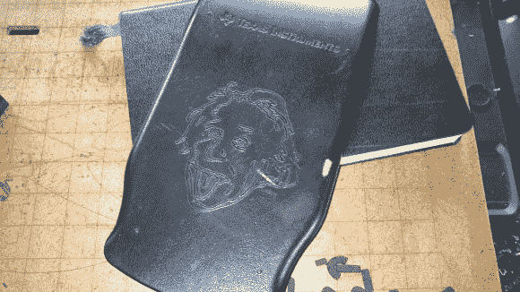

# 所有你需要知道的从废料制作激光雕刻机

> 原文：<https://hackaday.com/2013/05/09/everything-you-need-to-know-to-make-a-laser-engraver-from-scrap/>

看看[Sebastian Müller]用他从头开始制作的激光雕刻机在他的计算器封面上雕刻的爱因斯坦头像。我们认为他在构建方面做得很好，但我们更印象深刻的是他所做的工作，分享了他用来挽救和重新利用所有组件的技术。这是一个完美的资源，应该很容易适应不同型号/制造商来源的硬件。

他用一台旧扫描仪和一台旧打印机来打印大部分零件。这两者最初都包括步进电机驱动的台架，它们在他的弗兰肯斯坦激光雕刻机中一起形成 x 轴和 y 轴。当零件组装在一起时，他开始安装控制电子设备，包括几块 EasyDriver 步进电机板和一个 Arduino。

在这一点上，他把机器作为一个测试运行，附加一个标记到马车上使用它作为一个笔式绘图仪。在这次展示了稳定的表现后，Sebastian 继续添加激光二极管。他详细介绍了如何驱动二极管以及焦点对准。似乎[他的网页帖子](https://sites.google.com/site/capotexl/home/frankenstein-laser-cutter)与上面的 Instructable 链接有相同的内容，但我们想留下链接以防万一。