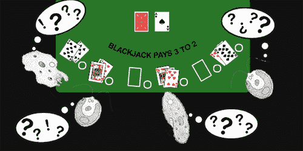

# 进化算法计算最佳 21 点策略

> 原文：<https://hackaday.com/2013/01/15/evolutionary-algorithms-computes-the-best-blackjack-strategy/>

不想通过通常的方式学习进化算法，通过随机字母生成句子，或者随机放置像素来生成蒙娜丽莎吗？[那就自己做进化算法吧！玩 21 点！](http://graphsandwords.com/blackjack.html)

[Brian]一直在研究进化算法，想要一个非常适合优化的任务。他选择了 21 点，因为可以发给玩家的手牌数量有限(32)，而庄家可以拿到的手牌数量很少(10)。

即使玩家和庄家的初始条件数量很少，仍然有 4.562 x 10^192 可能的手牌组合，因此强力推行 21 点策略将需要整个星球的计算能力。计算一个好策略的更简单的方法是进化算法，由[Brian]和[制表商 Java 库](http://watchmaker.uncommons.org/)实现。

在[Brian]的程序中，每一代都生成一个 32×10 的网格，每一个单元代表可能的玩家手对庄家手。在每一个格子里，电脑会给出一个“击中”、“停留”或“双倍下注”的策略，然后用这个策略玩上千手牌。最好的策略被孕育出来，最终[布莱恩]得到了一个好的 21 点策略。

由此得出的最佳策略相当不错——使用他的策略，他可以带着 96%的钱走出大西洋城赌场。