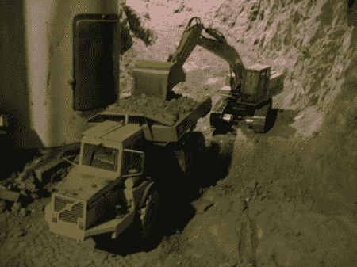

# 使用遥控设备挖掘你的地下室

> 原文：<https://hackaday.com/2012/07/28/excavate-your-basement-using-rc-equipment/>

虽然这是否是一次“黑客攻击”还存在争议，但由于使用的设备是为挖掘而建造的，其规模似乎值得一提。在链接的文章中，引用[Joe]的话说，“这里普遍的误解是，钢筋混凝土的不是在这里挖掘我的地下室，而是地下室挖掘项目是为钢筋混凝土的。”这可能是大多数制造商/黑客的座右铭，因为项目通常不是为了最终的产品而做，而是为了自己制作东西的体验。

根据[Joe]的说法，他用他的小型遥控车辆每年挖掘 2-3 立方码。作为一名农场主和农民，他住在加拿大，即使在寒冷的冬天，他也需要在家附近喂养饥饿的动物。在此期间，可以做的事情很少。在夏天有时一天工作 16 个小时后，他需要在家附近找点事做。休息后一定要查看挖掘视频，或者查看[原文](http://carscoop.blogspot.com/2012/02/meet-joe-man-who-excavated-his-basement.html "RC Excavation")获取更多图片和视频！

[https://www.youtube.com/embed/bmcC2bzJjME?version=3&rel=1&showsearch=0&showinfo=1&iv_load_policy=1&fs=1&hl=en-US&autohide=2&wmode=transparent](https://www.youtube.com/embed/bmcC2bzJjME?version=3&rel=1&showsearch=0&showinfo=1&iv_load_policy=1&fs=1&hl=en-US&autohide=2&wmode=transparent)