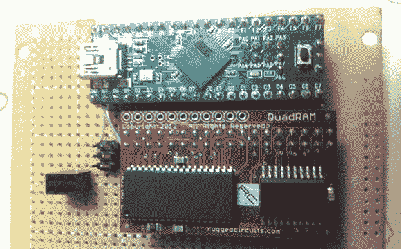

# Teensy++ 2.0 的扩展内存

> 原文：<https://hackaday.com/2014/02/17/expanded-memory-for-the-teensy-2-0/>

有时候，对于一个微控制器项目，你需要做一些非常耗费内存的操作，比如图像和音频处理。较大的 AVR 芯片当然足够快来完成这些任务，但这些芯片上的 RAM 有限。[xxxajk] [推出了一个库](https://github.com/xxxajk/xmem2)，它允许在 Teensy++ 2.0 微控制器上使用巨大的 RAM 扩展，使这些依赖于 RAM 的任务在我们最喜欢的微控制器板上变得容易。

[xxajk]的工作实际上是 XMEM2 的移植，这是他早期的一个项目，为 Arduino Mega 添加了 RAM 扩展和多任务处理。多达 255 组内存可用，通过支持的硬件，Teensy 可以寻址高达 512kB 的 RAM。

XMEM2 还具有多达 16 个任务的抢占式多任务处理、在任务间传输消息的能力以及 malloc()的所有乐趣。

该构建相当独立于硬件，能够与坚固的电路 [QuadRAM](http://ruggedcircuits.com/html/quadram.html) 和 [MegaRAM](http://ruggedcircuits.com/html/megaram.html) 扩展 Arduino Mega 以及[【安迪·布朗】的 512 SRAM 扩展](http://andybrown.me.uk/wk/2011/08/28/512kb-sram-expansion-for-the-arduino-mega-design/)一起工作。有了合适的 SRAM 芯片，在家里为 XMEM2 蚀刻电路板也是可能的。