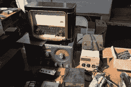

# 体验老式电子产品的“农贸市场”

> 原文：<https://hackaday.com/2014/09/19/experience-the-farmers-market-of-vintage-electronics/>

通常，当你想到农贸市场时，你会想到附近种植的新鲜农产品。这种经历是相似的，因为许多产品都是在当地构思的，但目标是绝不新鲜。上周末有机会参加了 2014 年最后的[电子跳蚤市场](http://www.electronicsfleamarket.com/)。我不能代表所有人，但几乎在任何情况下，人们都明显喜欢老式电子设备。你遇到的人就像被交换的设备一样有趣，即使在交换会结束后，社交活动仍会继续。

  Analog meters  Amp and Volt meters  Sony rack-mount video cassette equipment  If you like to dig  $5 scope  Vintage radios

#### 电子加

四处逛逛，有很多东西可以吸收。我主要对电子产品感兴趣(特别是工作台设备)，但也有从卖蜂蜜的摊位到为宠物项圈定制标签的绅士。旧货交易会在加州库比蒂诺德安扎学院的一个停车场举行。你可以免费进去，停车要花我 3 美元。

  A great old Kodak projector  Some type of rack-mount patch boards?  another great radio  This wasn’t the only reel-to-reel I saw    I don’t know what a ratiometer is  IM-ME, a hacking classic  No table necessary  HP5216 counter has Nixies for the display, nice!  A variety of dials  Calculator collector  Beowulf cluster waiting to happen?

我闲逛了大约 40 分钟，然后遇到了查尔斯·亚历山大。我在拜访他之前联系过他，因为他有时在旧货交易会上有自己的摊位。是他告诉我，所有酷的东西在早上 7 点就不见了……我大概晚了 3 个小时才达到那个基准。

很高兴看到[查尔斯]不仅仅是交换设备。他带来了一些展示和讲解。这是一些他自己设计和制造的真空管。大部分原材料来自大规模生产其他管的下脚料。我希望他能为我们写一篇文章，详细介绍他的制作技术。

 [![[Charles Alexanian] posing with his custom tube](img/ca6d918a6a899784db8cb616ee65b9f5.png "DSC_0194")](https://hackaday.com/2014/09/19/experience-the-farmers-market-of-vintage-electronics/dsc_0194-2/) [Charles Alexanian] posing with his custom tube  Tubes on exhibit along with a few uCs for sale

#### 有一个庆功宴

[查尔斯]和我计划在号称硅谷最好的汉堡市场打烊后和其他常客一起去圣约翰。我又逛了一会儿，看看其余的过道。太阳是邪恶的，所以如果你打算花一些时间挖掘交易，请确保涂上厚厚的防晒霜。

  Audio Equipment  Enigma machine (kidding of course!)  Loose parts  Sockets and ICs  Resistors and connectors  CRT  Close view of the CRT  Atari 810 Floppy Drives  Atari 800 collection  More hardcore equipment      

#### 你永远不知道你会碰到谁

逛了一圈后，我坐在[查尔斯]卡车的后挡板上，邪恶疯狂科学家实验室的[温德尔]发现了我。我们最初是在 5 月份的 Maker Faire Bay Area 见面的。我没能在那次的[the Brian Hack 晚宴](https://www.facebook.com/events/185000228217077/)上和他打成一片(看起来[【布莱恩】和【亚当】这周末在纽约弥补了那次](https://twitter.com/hackaday/status/512639928396574720))。

他和[丽诺尔]问我是否会去吃早餐，我想他们指的是之前提到的圣约翰之旅。并非如此。跳蚤市场之后的社交活动似乎比比皆是，因为在库比蒂诺的波比咖啡馆有一场由保罗·兰科主持的工程师早餐会。[查尔斯]说，他没有看到很多圣约翰的常客，所以我们决定改变计划，但在最后一次清扫供应商区之前。

  Cellphone bin  Calculator Bin  Camera bin  SLR table  Rations? Dated 1962  Art  Meters and dials  Meter panel

#### 工程师的早餐

芭比咖啡馆的露台是十几个工程师在每次交流会后的聚集地。我遇到了保罗·拉科，他拍了下面三张照片，但我和他在第四张照片中摆了姿势。照片中还有 [EMSL](http://www.evilmadscientist.com/) 的联合创始人【温德尔·奥斯凯】和【莲娜·埃德曼】。他们后来带我参观了他们的巢穴，我会留到下一篇文章再讲。

多么美好的早晨和奇妙的冒险。如果你真的发现自己在明年的工程师早餐会上，我推荐玉米牛肉杂碎。

 [![Mike Szczys [left] and Paul Rako [right]](img/ee4265e762140a25de64d10aeaf13349.png "IMG_20140913_131751")](https://hackaday.com/2014/09/19/experience-the-farmers-market-of-vintage-electronics/img_20140913_131751/) Mike Szczys [left] and Paul Rako [right]     