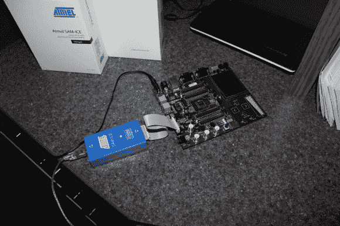

# 解释你不知道的关于 ARM 编程的底层内容

> 原文：<https://hackaday.com/2013/09/17/explaining-the-low-level-stuff-you-dont-know-about-arm-programming/>

我们大多数人都没有意识到我们是多么被互联网上不同的开发环境宠坏了。如果有人想在一个新的[ARM/DSP/…]平台上开始一个空白项目，他通常会启动专用集成开发环境(IDE)并开始编写 C/C++程序。但是，在程序正确运行之前，需要许多初始化例程和脚本。在他的伟大文章中，【Andrew】向我们解释了在不使用任何 IDE 的情况下启动一个空白项目是什么。

如上图所示，[Andrew]的项目是围绕一个 Atmel SAM4E 微控制器展开的。选择的工具链是来自用于 arm 嵌入式处理器的 GNU 工具的 arm-none-eabi-gcc。本文的第一部分首先简单解释了如何/为什么将代码和变量分割到不同的内存段中。bss，。数据，。罗达塔。text)，然后[Andrew]详细介绍了链接器脚本如何根据微控制器的内存布局将这些部分放在不同的物理地址。他还向我们展示了如何处理[栈](http://www.avr-tutorials.com/general/avr-microcontroller-stack-operation-and-stack-pointer)放置、[向量表](http://en.wikipedia.org/wiki/Interrupt_vector_table)、变量(非)初始化和 C 运行时。作为参考，后者在处理器启动时执行，它负责设置堆栈指针、初始化 RAM、设置标准库和调用 main()。

这是一个非常好的介绍，介绍了在大多数处理器上运行的非常低级的例程。