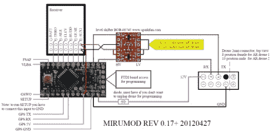

# 扩展 AR 无人机的范围，两种方式。

> 原文：<https://hackaday.com/2012/08/23/extending-the-range-of-the-ar-drone-2-ways/>

[https://www.youtube.com/embed/1Y-qk03vpeY?version=3&rel=1&showsearch=0&showinfo=1&iv_load_policy=1&fs=1&hl=en-US&autohide=2&wmode=transparent](https://www.youtube.com/embed/1Y-qk03vpeY?version=3&rel=1&showsearch=0&showinfo=1&iv_load_policy=1&fs=1&hl=en-US&autohide=2&wmode=transparent)

正如我之前提到的，我们有一个 AR 无人机可以玩。互联网上弹出的一个常见的 mod 是扩展 AR 无人机范围的方法。它通常使用本地 Wi-Fi 连接到您的手机或平板电脑，以获取控制和视频信号。许多人发现这相当严格，并在扩大范围方面走得很远。

第一个也是最简单的方法就是在你飞行的地方建立一个更大功率的 Wi-Fi 网桥。这架无人机只有大约 15 分贝的 wi-fi 魔法，所以任何比这更强的都是一种改进。关于这个有太多的变化去探究细节，但是正如你所看到的，没有太多的变化。

[https://www.youtube.com/embed/8kqAECusT3M?version=3&rel=1&showsearch=0&showinfo=1&iv_load_policy=1&fs=1&hl=en-US&autohide=2&wmode=transparent](https://www.youtube.com/embed/8kqAECusT3M?version=3&rel=1&showsearch=0&showinfo=1&iv_load_policy=1&fs=1&hl=en-US&autohide=2&wmode=transparent)

第二种方法是把 Wi-Fi 控制系统完全换成一个好看的 R/C 控制器。这将大大增加你的范围，并给你额外的渠道来触发不同的附件(通常是灯)。我见过两种主要的方法。一个叫“麦克盖弗 mod”。这是一个[即插即用套件，似乎没有太多的信息。](http://macdrones.com/drone2.html)

另一个叫做“MiruMod ”,创造者[已经分享了他们能够分享的所有信息](http://mirumod.hopto.org)。您可以找到零件分解图、原理图、接线图、说明和软件。[Miru]使用 Arduino Pro Mini 或 Arduino Nano 作为接收器与 AR 无人机上的串行端口之间的媒介。你可以在下面的线路图中看到，这是一个相当简单的安装，所有[miru]要求的是，如果你欣赏他的 mod，也许你可以捐一些啤酒钱。

