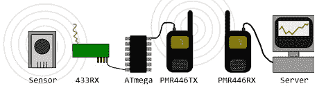

# 用对讲机扩大无线气象站的覆盖范围

> 原文：<https://hackaday.com/2012/04/14/extending-the-range-of-wireless-weather-stations-with-walkie-talkies/>

[Roel]想在他的温室里放一个无线气象站。尽管气象站应该能够传输相当长的距离，但即使在他的无线气象站设置的接收端安装了良好的天线，他后院的几何形状和几堵石墙还是扼杀了无线电信号。想要让他的气象站工作，[Roel]做了明智的事情，用一对对讲机建造了一个分组无线电装置，大大增加了他的气象站的覆盖范围。

这是在[Roel]花了大量时间对他的[蒂埃里·穆勒气象站](http://www.alibaba.com/product-tp/112919034/Wireless_weather_station_with_outdoor_unit.html)的无线协议进行逆向工程之后建造的。只需一点点代码，[Roel]就可以将当前的温度和湿度读数输入到他的 Linux 机器中。这个系统依赖于气象站内部的发射器，所以这个系统在任何足够大的距离内都会崩溃。

为了扩大气象站的覆盖范围，[Roel]利用现有的硬件，增加了一对廉价的 FRS 对讲机。该构建使用他以前构建的硬件从气象站获取无线电数据。这些数据被发送到 ATmega88，在那里被[转换成分组无线电](http://roel.reijerse.net/repeater/#part1)并通过对讲机发送出去。在[接收方](http://roel.reijerse.net/repeater/#part2)，第二台对讲机的输出通过管道传输到 Linux soundmodem 应用程序([链接](http://www.baycom.org/~tom/ham/soundmodem/)，但在本文撰写之时已经关闭)并被解码。将接收到的数据发送到 gnuplot 会生成一个非常好的温度和湿度图。

[Roel]将构建的 tx 和 rx 端的代码放在他的构建页面上。非常好的工作，使用非常便宜的硬件。