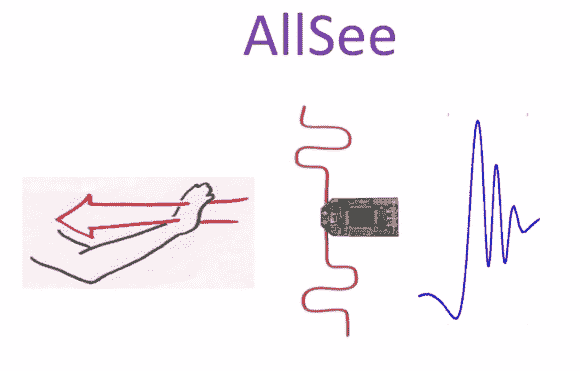

# 从现有无线信号中提取手势信息

> 原文：<https://hackaday.com/2014/04/15/extracting-gesture-information-from-existing-wireless-signals/>

华盛顿大学的一个团队最近开发了 [Allsee](http://allsee.cs.washington.edu/) ，这是一种由非常少的组件组成的简单手势识别设备。与发射自己的射频信号的传统多普勒模块(像[这个](http://hackaday.com/2013/08/14/making-the-electronics-for-a-doppler-motion-sensor/))相反，Allsee 使用已经存在的无线信号(电视和 RFID 传输)来提取它前面可能发生的任何运动。

Allsee 的接收器电路使用一个简单的包络检波器来提取幅度信息，并将其馈入微控制器模数转换器(ADC)。因此，每个手势都会产生一个半独特的足迹(见上图)。足迹可以被分析以在你的电脑/手机上启动一个专门的动作。 [PDF 文章](http://allsee.cs.washington.edu/files/allsee.pdf)声称，该团队在一组八个手势上实现了 97%的分类准确率。

显然，该系统的主要优势是其低功耗。休息之后会嵌入一个很好的演示视频，我们想感谢[科尔比]向我们透露了这个故事。

[https://www.youtube.com/embed/tJCQZxi_0AI?version=3&rel=1&showsearch=0&showinfo=1&iv_load_policy=1&fs=1&hl=en-US&autohide=2&wmode=transparent](https://www.youtube.com/embed/tJCQZxi_0AI?version=3&rel=1&showsearch=0&showinfo=1&iv_load_policy=1&fs=1&hl=en-US&autohide=2&wmode=transparent)