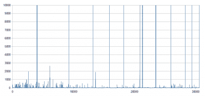

# 从高清视频中提取雷击

> 原文：<https://hackaday.com/2015/05/11/extracting-lightning-strikes-from-hd-video/>

闪电摄影是一门艺术。它需要很大的耐心，直到最近还需要一些花哨的装备。[Saulius Lukse]一直对闪电风暴着迷。当他还是个孩子的时候，他经常用他父亲的旧 Zenit 相机拍摄闪电——这相当具有挑战性。现在他想出了一个办法，用 GoPro 来做这件事。

他在 1080@60 拍摄，我们承认这不是最大的分辨率，但我们相信下一个 GoPro 接下来会拍摄 4K60。这意味着你可以在暴风雨期间在户外设置 GoPro，让它做它最擅长的事情——拍摄视频。通常情况下，你必须编辑镜头并提取每个闪电帧。这可能需要大量的工作。

[Saulius]使用 OpenCV 编写了一个 Python 脚本。基本上，OpenCV 脚本通过检测图像中的快速变化来发现闪电并将运动数据保存到 CSV 文件中。

结果呢？所有的闪电帧都是从镜头中提取出来的，而 i7 处理器只花了大约 8 分钟来分析 15 分钟的高清镜头。还不错。

现在，如果你觉得这仍然是欺骗，你可以为你的 DSLR 造一个别致的自动触发器……