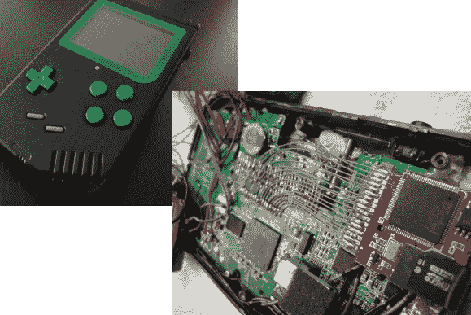

# 极端游戏男孩 Hack 从广泛的系统玩标题

> 原文：<https://hackaday.com/2013/03/14/extreme-game-boy-hack-plays-titles-from-a-wide-range-of-systems/>

[Akira]可以在旅途中玩任何 Game Boy、GBC、GBA、NES、SNES 或 SMS 游戏，这要感谢他为这个便携式游戏黑客所做的一切工作。外面似乎很熟悉；这是一个原始的游戏男孩案件。但是你应该马上注意到它有几个额外的按钮。这是第一个线索，里面的东西不是股票…这是一个巨大的保守说法。

该项目的想法开始时相当简单，但很快就失去了控制([查看构建日志](http://www.made-by-bacteria.com/viewtopic.php?f=18&t=1322)了解详细信息)。他觉得原屏幕有背光就好了。在喜忧参半的结果之后，他放弃了原来的主板，用一些任天堂 DS Lite 硬件重新开始。它的 LCD 连接器坏了，所以他尝试了几种不同的修复方法让它再次工作。取得一些成功后，他开始添加更多的设备，如额外的一对按钮，电池门上的一个更好的扬声器，以及你可以在上面看到的 microSD 插件。

跳完之后可以抓到成品的试玩。

[https://www.youtube.com/embed/d9KrlGChPy8?version=3&rel=1&showsearch=0&showinfo=1&iv_load_policy=1&fs=1&hl=en-US&autohide=2&wmode=transparent](https://www.youtube.com/embed/d9KrlGChPy8?version=3&rel=1&showsearch=0&showinfo=1&iv_load_policy=1&fs=1&hl=en-US&autohide=2&wmode=transparent)

[感谢唐宁]