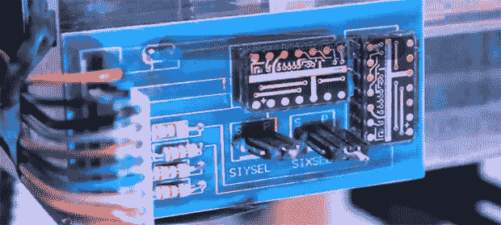

# 极其精确的位置跟踪

> 原文：<https://hackaday.com/2013/10/10/extremely-precise-positional-tracking/>

卡内基梅隆大学的几个人想出了一个非常简单的方法来做高速运动跟踪，只需要一个手电筒。它被称为 Lumitrack，虽然它表面上看起来像一个 Wiimote，但实际上它更加准确和精确。

该系统通过将结构光投射到两个线性光学传感器上来工作。光的图案是一个 m 序列——基本上是一个条形码，其中 m 序列的每个子集都是唯一的。通过将这种光照射到一个线性传感器上，Lumitrack 可以计算出光来自哪里，从而计算出支撑光的物体的位置。

尽管整个系统仅由一个 ARM 微控制器(以 Maple Mini 板的形式)、两个线性光学传感器和一个带有 m-sequence 凝胶的手电筒组成，但它非常准确，速度非常非常快。该团队能够以超过 1000 帧/秒的速度读取位置，这几乎是 Maple 串行连接所能达到的极限。

这个系统已经有了一些有趣的应用——游戏控制器，包括剑、飞行轭和玩具车，还有更多艺术作品，如虚拟喷漆罐。这是一项有趣的技术，只要有合适的零件，我们任何人都可以在家里制作。

你可以在下面看到 Lumitrack 的演示视频。

[https://www.youtube.com/embed/htYAWXXoZa0?version=3&rel=1&showsearch=0&showinfo=1&iv_load_policy=1&fs=1&hl=en-US&autohide=2&wmode=transparent](https://www.youtube.com/embed/htYAWXXoZa0?version=3&rel=1&showsearch=0&showinfo=1&iv_load_policy=1&fs=1&hl=en-US&autohide=2&wmode=transparent)