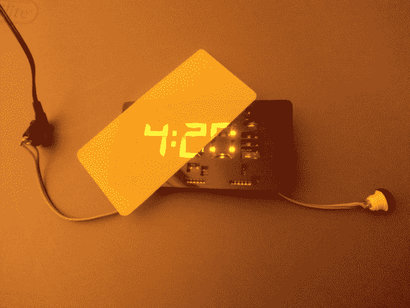

# 外在动机:集成房间日出模拟器

> 原文：<https://hackaday.com/2014/08/28/extrinsic-motivation-integrated-room-sunrise-simulator/>

一个 Hackaday 奖项的参赛作品没有进入半决赛，但值得拥有自己的特色帖子，这是一个模拟早上日出的无线闹钟。它是由[Ceady]发明的，连接到一个墙内调光器，在 10 分钟内缓慢但稳定地增加光线，以帮助轻轻地唤醒一个睡着的人。无线接口控制照明装置的速度，并且能够在按下贪睡按钮时关灯。这是一个整洁的小黑客，以一种良好的物联网类型的方式将典型的报警系统和室内照明结合在一起。我们预见在不久的将来，像这样的物品将会在日常家居卧室中使用。

电路原理图已经上传到 Hackaday.io 页面，同时还有详细的项目日志和元件零件列表。休息之后，我们将播放一段测试闹钟的视频:

* * *

这个项目是[正式进入](http://hackaday.io/submissions/prize/list)hack aday 奖，遗憾的是[没有进入四分之一决赛选择](http://hackaday.io/list/2864-The-Hackaday-Prize%3A-Semifinalists)。这仍然是一个伟大的项目，它本身就值得在 Hackaday 上发表。

[https://www.youtube.com/embed/-_oC-QTgq18?version=3&rel=1&showsearch=0&showinfo=1&iv_load_policy=1&fs=1&hl=en-US&autohide=2&wmode=transparent](https://www.youtube.com/embed/-_oC-QTgq18?version=3&rel=1&showsearch=0&showinfo=1&iv_load_policy=1&fs=1&hl=en-US&autohide=2&wmode=transparent)