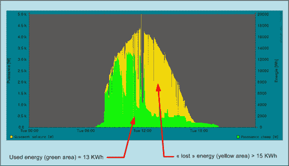

# 外在动机:离网太阳能系统监控解决方案

> 原文：<https://hackaday.com/2014/08/30/extrinsic-motivation-off-grid-solar-system-monitoring-solution/>

[这个太阳能监测项目](http://hackaday.io/project/2333)参加了 Hackaday 奖，但没有进入半决赛，但它值得在网站上展示，因为我们认为它很酷。这个想法可以追溯到 2013 年 5 月，当时[Michel]计划尝试将他的房子完全脱离电网，以尽可能独立于当地的公用事业公司。经过一番计算，他发现屋顶上的太阳能电池可以提供大约 80%的电力需求，这当然考虑到了他所在地区冬季缺少阳光的情况。

[Michel]在 Hackaday.io 页面上发布了许多技术细节，并列出了设置该系统所需的组件。到了晚上，一个照明装置会显示建筑是依靠光伏系统还是从电网获得电力。他在项目日志中陈述了监控太阳能电池的重要性，并提供了一些惊人的数据图表，这些数据是通过他集成到家中的能源智能平台记录的。下面可以看到一个例子。该项目的一些快速规格包括由 16 个太阳能模块组成的太阳能场，提供 4300 Wp(瓦特-峰值)的电力。该系统还配有一个全面的遥控器。我们非常喜欢这个想法。现在，你会在自己的家里或办公室安装这样的东西吗？请在评论中告诉我们。

* * *

这个项目是[正式进入](http://hackaday.io/submissions/prize/list)hack aday 奖，遗憾的是[没有进入四分之一决赛选择](http://hackaday.io/list/2864-The-Hackaday-Prize%3A-Semifinalists)。这仍然是一个伟大的项目，它本身就值得在 Hackaday 上发表。

