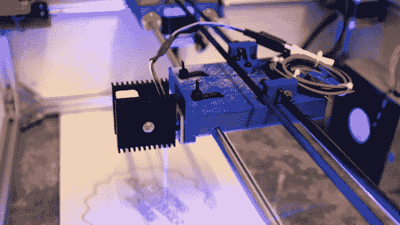

# 挤压导轨和 3D 打印连接器构成了一个合适的激光雕刻机

> 原文：<https://hackaday.com/2013/09/07/extruded-rail-and-3d-printed-connectors-form-a-proper-laser-engraver/>

快速和准确是对这个由[Ragnar]和[Gunnar]建造的激光雕刻机的很好的描述。他们计划在新年后的特隆赫姆创客节上展示它，但他们在去年 8 月的 PSTEREO 迷你创客节(也在特隆赫姆)上把它带到了野外。下面的视频概述了建造过程和雕刻师的工作。但是我们也喜欢阅读关于早期原型开发过程中的一些失误的帖子。我们称之为一个合适的激光雕刻机，因为它是从零开始专门建造的。我们仍然喜欢看雕刻师从光驱中砍出的[，但相比之下，这真的是一匹不同颜色的马。](http://hackaday.com/2011/03/11/bench-top-laser-engraver-does-some-cutting-too/)

从一开始，他们就使用熟悉的零件来制造 CNC。外部框架由挤压成型的铝轨制成，带有精确的杆，便于门架在上面滑动。步进电机和齿形带有助于移动，所有的连接和安装部件都是在 3D 打印机上制造的。早期(不幸的是大部分是组装的)原型犯的错误是 Y 轴只在一侧被驱动，而实际上它需要在两侧被驱动。但是灯丝相对便宜，所以对设计进行一些调整就可以解决这个问题，让生产回到正轨。

[https://player.vimeo.com/video/72553488](https://player.vimeo.com/video/72553488)