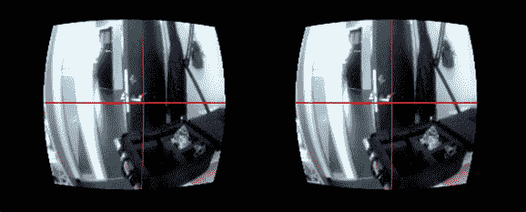

# 用 Oculus Rift 进行眼球追踪

> 原文：<https://hackaday.com/2014/05/01/eye-tracking-with-the-oculus-rift/>

当涉及到界面设计时，你可以用眼睛和视线跟踪做很多事情，所以当[Diako]得到 Oculus Rift 时，[真的只有一件事可做](http://www.itu.dk/research/eye/?page_id=671)。

就像我们见过的其他一些眼球追踪解决方案一样，[Diako]使用一个移除了红外滤光器的小型相机来读取眼睛瞳孔的形状和位置，以确定用户在看哪里。这确实需要在 Oculus 的一个眼杯附近切一个小洞，但内部摄像头工作得很好。

为了打开通往世界的窗户，如果是的话，[迪亚科]在 Oculus 的前面安装了另一个摄像头。这两个摄像头被输入到同一台计算机中，视线追踪与耳机前面的图像重叠，用户马上就能看到他们在看哪里。

是的，使用计算机来知道你在看哪里看起来似乎是一个相当无用的构建，但像这样的东西被用于研究和非常高科技的平视显示器。虽然他没有使用 Oculus 上的运动跟踪，但如果[迪亚科]这样做，他将拥有最强大的平视显示器之一。

[https://player.vimeo.com/video/90663598](https://player.vimeo.com/video/90663598)