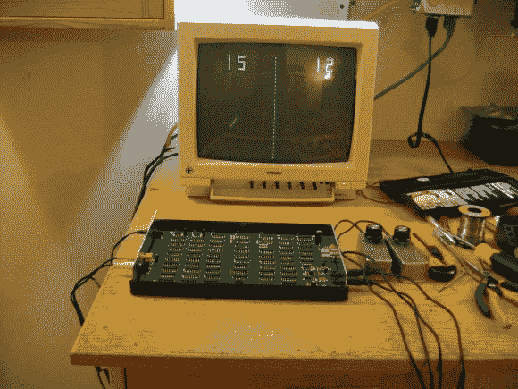

# 根据原始 Arcade Pong 原理图制造硬件

> 原文：<https://hackaday.com/2012/12/22/fabricating-hardware-from-the-original-arcade-pong-schematics/>

这个密集的 PCB 是 Pong 的原始街机版本的再现。这是一个重要的区别，因为家庭版 Pong 使用一个专门的芯片来完成大部分工作。这基本上是所有的股票逻辑，这解释了高组件计数。我们想知道当时花了多少个季度才付清所有 66 个筹码？

[Pong74ls]是承担这个项目的人。有一个原始的原理图，但它非常拥挤，很难弄清楚。幸运的是[丹·鲍里斯]已经做了很多繁重的工作。他把这个一页的噩梦变成了一个 16 页的计划，用来建造最初的电路板。

在电路板被设计出来之前，一些重新设计的工作是必要的。听起来一些原始芯片已经停产，需要找到合适的替代品。然后，在将设计发送到工厂之前，电路板在 Eagle 中进行布局。只有一个错误，当球向下运动时，不允许球在击球时反弹。几根跳线就把它修好了！

[via [Reddit](http://www.reddit.com/r/ECE/comments/14x20r/the_original_pongs_schematic_and_rebuilt/)

[ [最初的 Reddit 帖子](http://www.reddit.com/r/gaming/comments/14wr0a/to_build_a_video_game_from_scratch_you_must_first/)