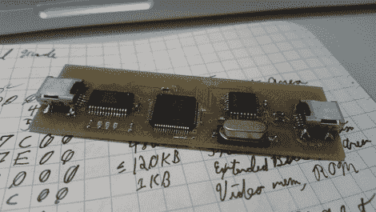

# Facedancer Board 可以让你的 Python 程序伪装成 USB 硬件

> 原文：<https://hackaday.com/2012/07/05/facedancer-board-lets-your-python-programs-pretend-to-be-usb-hardware/>

这是 Travis Goodspeed 的新 USB 开发工具的原型板，叫做 Facedancer。他的设计考虑到了 USB 安全漏洞，但我们认为它对于普通的开发也有很大的潜力。

在给这个项目命名时，对[弗兰克·赫伯特]的引用值得称赞。就像沙丘神话中的人物可以完美地模仿他们接触的任何人一样，这个设备可以让你模仿任何你可以想象的东西。一个 USB 端口连接到受害者(或主机)，另一个连接到开发机器。Python 可以用来实时发送 USB 命令。可以认为这与总线盗版者对 SPI 和 i2c 做的事情是一样的，只是它是在 USB 协议本身上做的。这样，您可以在开发新设备(或测试漏洞)的所有困难中摸索前进，而无需不断编译和刷新您的硬件。