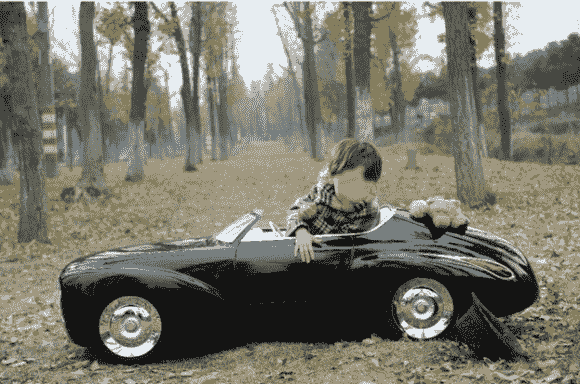

# 无脸小孩的工程师父亲为他建造了一个惊险的游乐设施

> 原文：<https://hackaday.com/2013/01/22/faceless-childs-engineer-father-builds-him-a-breathtaking-ride/>

好吧，这孩子确实有张脸，但看起来像是爸爸为了保护他而弄模糊了。这里的真实故事是由他的工程师父亲建造的杀手之旅。它比 Hackaday 团队驾驶的汽车好得多，但话说回来，因为它比宝马 3 系贵，这并不奇怪。

[紫菱]住在中国，以定制汽车为生。因此，为他的儿子承担这个项目与其说是出于他的能力，不如说是出于他的财力。这款车采用了定制的框架，带有齿轮齿条转向、盘式制动器、后差速器和著名的悬挂系统。车身由碳纤维制成。所有的灯都亮着，司机座位后面安装了一个电动马达和传动装置。不幸的是，没有这方面的视频(中国屏蔽了 YouTube)。但是请看看上面的相册，看看最后的油漆工作的照片。在[紫菱的] Reddit 讨论中还可以找到更多的信息[。](http://www.reddit.com/r/pics/comments/16ziv8/so_i_surprised_my_son_a_few_months_ago_with_a/)