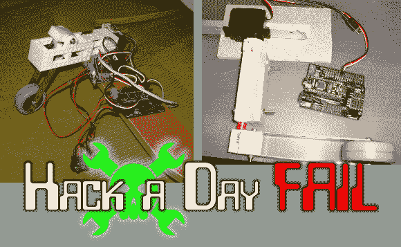

# 本周失败:自动婴儿摇椅

> 原文：<https://hackaday.com/2013/11/14/fail-of-the-week-automatic-baby-rocker/>

黑客艺术要求你跨越许多不同类型的工程。在这种情况下，看起来[丹]可以用一点头脑风暴如何让这个双重失败的项目回到正轨。请对他宽容些，因为他不是提交本周失败报告的人。

他着手制造一个自动婴儿摇椅，他称之为婴儿蹦床。这个想法很简单，但是执行变得有点难以管理。他的第一次尝试显示在右边。这是一个相当强大的伺服电机，连接到一个摇臂，终止于一个轮子。他用手工加工的 [Delrin](http://en.wikipedia.org/wiki/Delrin) (嗯，你知道我们指的是什么)来制作连接部件。有足够的扭矩，因为这没有问题切断固定螺钉。但是机械优势并不存在。

第二次迭代在左边。你可以看到他已经把它安装在摇杆上了，但这基本上是行不通的。白色框架由 OpenSCAD 设计，Shapeways 打印。它过渡到一个带螺纹杆的步进电机，将力传递给轮式机器人。看看下面的视频，看看阻力是如何导致机械装置滑动的。

我们认为这种设计需要增加两点:机械优势和缓解堵塞。请就如何使这位摇滚歌手达到标准提出你的建设性意见。这可能是展示您的图表创建技能的好时机。

[谢谢马特]

* * *

** 每周失败是一个每周三运行的黑客专栏。通过写下你过去的失败和[给我们发送一个故事的链接](mailto:tips@hackaday.com?Subject=[Fail of the Week])，或者发送你在互联网旅行中发现的失败报道的链接，来帮助保持乐趣。**