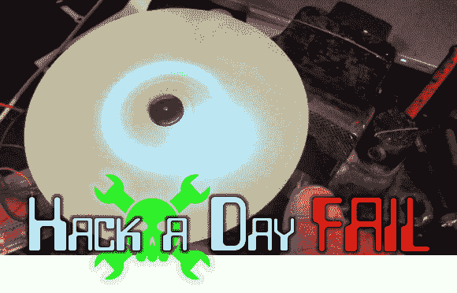

# 本周失败:[凯勒的]磷光 CD 播放器

> 原文：<https://hackaday.com/2013/10/17/fail-of-the-week-calebs-phosphorescent-cd-player/>

当[Caleb Kraft]全力制作《Hackaday》时，他制作了一大堆精彩的视频。但并不是每个项目都成功了。他是“一周失败”帖子的粉丝，并上传了自己对一个项目失败的回忆。上面你可以看到他的磷光 CD 播放器。去年 5 月，他设计了这个项目的原型，但技术问题和迫在眉睫的最后期限意味着它永远不会出现。跳跃后我们会告诉你他失败的原因。

编者按:我们需要更多关于你自己失败的提示！我们的储备中只剩下少量的提交内容，但是为了保持这个主题作为每周专栏，我们需要帮助跟踪更多失败的项目。请记录你过去的失败，[给我们一个链接。如果你没有博客来发布，你可以像 Caleb 那样直接给我们发邮件。请记住，包括任何图像和视频链接，你可能有。](mailto:tips@hackaday.com?Subject=[Fail of the Week])

这个项目的要点是[Caleb]想用一个 LED 为一些夜光涂料充电。他能想到的最简单的机械装置是使用光驱，光盘本身作为移动的显示器，镜头滑动作为移动光源的方式。[Caleb]自己的话讲述了他遇到的成功和失败:

> 嘿，迈克和伙计们，让我先说我真的很喜欢这个网站的新方向。在我看来，你们真的很了不起。我真正喜欢的新事物之一是失败。我想我会分享我在 hackaday 时的一个失败，一个没有取得很大进展的项目，但我认为它有一些非常酷的潜力。
> 
> 正如许多人已经知道的，我对发光的东西有点着迷。我真的受到了《幽灵矩阵》的启发，并立即开始思考我可以做的类似的事情。
> 
> 我想出的，没有明显原因的代号为恩克拉多斯，将是一个光盘大小的发光可视化。
> 
> 一开始，事情看起来不错。我从一叠 CD 中拿出一张透明的保护性 CD，把它磨损了，然后用深色喷漆把它喷了下去。它裂开了一点，但我不在乎，因为这将是一个概念的证明。我把 CD 播放器的托架拆下来，用 LED 取代了激光。起初我用的是白色的，然后我跑去商店买了一些紫外线发光二极管

[https://www.youtube.com/embed/-4MkPQsUElM?version=3&rel=1&showsearch=0&showinfo=1&iv_load_policy=1&fs=1&hl=en-US&autohide=2&wmode=transparent](https://www.youtube.com/embed/-4MkPQsUElM?version=3&rel=1&showsearch=0&showinfo=1&iv_load_policy=1&fs=1&hl=en-US&autohide=2&wmode=transparent)

> 我认为它看起来足够好，可以继续。所以我做了！我修复了 LED 间距问题，这样就不会摩擦了。然后，我添加了移动 LED 的控件，以及控制主轴电机的 PWM。

[https://www.youtube.com/embed/V5XwEmySMGc?version=3&rel=1&showsearch=0&showinfo=1&iv_load_policy=1&fs=1&hl=en-US&autohide=2&wmode=transparent](https://www.youtube.com/embed/V5XwEmySMGc?version=3&rel=1&showsearch=0&showinfo=1&iv_load_policy=1&fs=1&hl=en-US&autohide=2&wmode=transparent)

> 在这一点上，我发现可怜的马达根本无法处理低速。要么很快，要么什么都没有。我本打算把它拆下来，装上一个步进电机，以便更好地控制，但那个夏天我几乎是从一个海岸到另一个海岸的黑客空间之旅分散了我的注意力。
> 
> 我很确定我很久以前就抛弃了硬件，但是这个项目我不介意在将来以更好的方式重新审视。
> 
> 谢谢，
> 卡卡夫
> 【www.calebkraft.com】T2
> www.thecontrollerproject.com

这里的失败实际上与我们上周提到的非常相似。问题是 CD 需要足够慢地移动以使 UV LED 为磷光体“充电”。它还需要足够精确，以实现某种有意义的分辨率。我们想知道你对这个项目的想法。替换步进电机是最好的方法吗，或者用正确的[无刷电机控制器](http://hackaday.com/2013/09/21/building-a-brushless-motor-controller-around-an-atmega-chip/)可以可靠地驱动它吗？即使电机控制被解决了，你认为单个光源能够足够快地给磷光体充电，以便在发光材料恢复正常之前读取信息吗？

* * *

** 每周失败是一个每周三运行的黑客专栏。通过写下你过去的失败和[给我们发送一个故事的链接](mailto:tips@hackaday.com?Subject=[Fail of the Week])，或者发送你在互联网旅行中发现的失败报道的链接，来帮助保持乐趣。**