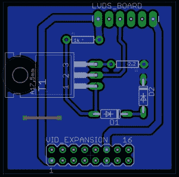

# 本周失败:泰迪托普和十四失败

> 原文：<https://hackaday.com/2014/12/11/fail-of-the-week-teddy-top-and-fourteen-fails/>

去年夏天，[奎因]去了堪萨斯城参加一年一度的苹果 II 大会。在那里，她拿起了最现代的苹果 II 系统，而不是建筑怪异的 IIGS:她拖回家一台苹果 IIc+，这是一台奇怪的小机器，看起来像一台没有屏幕的老式笔记本电脑。

不满足于让一台旧电脑只是漂亮地放在架子上，[奎因]正在进行一个名为泰迪陀螺的项目。“泰迪”是苹果 IIc 的代号之一，虽然在 80 年代就有将这种书本大小的电脑变成类似笔记本电脑的附件，但这些解决方案没有经受住时间的考验。[Quinn]正在为她的 IIc+建立她自己的蛤壳式加法，[并且不知何故在某些她在](http://quinndunki.com/blondihacks/?p=2066)之前已经做了几百次的事情上失败了。

虽然 IIc+具有 NTSC 复合输出，但用于 IIc+的超级特殊视频附件使用了 DB15 扩展连接器。在这里，任何附加元件都可以访问视频同步信号、来自音频电路的音频信号，甚至可以驱动高达 300 mA 负载的+12V 线路。恰好[奎因]在这个项目中使用的显示器在 12V，200 mA 下运行。一切都很好，但作为这台电脑在地球上存在的值得信赖的受托人，[奎因]认为应该在她的插件中包含一点电流限制。她设计了一个围绕 NPN 功率晶体管的电路，这将允许显示器汲取功率，直到负载约为 250 毫安。在那之后，晶体管将开始把多余的能量转化为热量。是的，保险丝会更好。[奎恩]称之为失败 1 号。还有十三个。

随着电路在试验板上工作，[奎因]需要一些更永久的东西来贴在她的泰迪上衣上。这是一个简单的电路，非常适合 protoboard，但[Quinn]决定制作一个 PCB。[【Quinn】的家用 PCB 制造是她的专长](http://hackaday.com/2014/01/05/testing-the-limits-of-home-pcb-etching/)，能够在电路板上以 5 密耳的间距放置 16 密耳的走线。这对于一个中国板房来说已经不错了，更别说她厨房里的人了。

第一块电路板忽略了考虑输入接头如何映射到 DB-15 IIc+扩展端口。又一次失败。

在 PCB 工艺取得如此多的成功后，[Quinn]显然对可能出现的错误感到自满。显影剂不起作用，为了科学起见，她摆弄了显影剂时间、紫外线曝光时间和铜蚀刻时间。一切都失败了，直到她意识到显影剂应该稀释到 10:1。我们在这里会失败 8 次。

随着 PCB 被正确蚀刻，[Quinn]可以看到她在铜中蚀刻的电路。她在板子上钻孔，开始组装，并意识到板子是它应该有的镜像。以某种方式修正这个产生了另一个镜像，第三次检查所有东西产生了另一个倒像。在鹰的铜层上写些文字。

有了工作板，就该组装电路了。当电路在试验板上工作时，铜走线的电阻刚好足以摆脱实验确定的电阻值。虽然限流器电路会将试验板上的所有电流保持在 250 mA 以下，但随着铜走线电阻的略微增加，PCB 电路的限值会飙升至 310 mA，超过 IIc+所能提供的电流。这是失败 13。

最终的失败是翻转功率晶体管的集电极和发射极，这也是[奎因]应该在试验阶段发现的。通过限流器运行视频和电源的想法一直都是无效的。

在这一点上[奎因]决定减少她的损失。无论如何，LCD 板只消耗 200mA，她选择直接将其直接连接到 IIc。如果 IIc 需要保护，将投入一个 250 毫安的保险丝。足够简单，而且不那么令人恼火。

在固定电路的情况下，泰迪陀螺的原型工作得非常完美:由 IIc 上的扩展端口供电的屏幕是一个工作显示器。不需要额外的电线。至少，这是一个极简主义的练习:不要做你不需要做的事情。如果你决定反对这一点点建议，至少你会在这个过程中学到一些东西。

[https://www.youtube.com/embed/C1NpK0Vo4Ho?version=3&rel=1&showsearch=0&showinfo=1&iv_load_policy=1&fs=1&hl=en-US&autohide=2&wmode=transparent](https://www.youtube.com/embed/C1NpK0Vo4Ho?version=3&rel=1&showsearch=0&showinfo=1&iv_load_policy=1&fs=1&hl=en-US&autohide=2&wmode=transparent)

* * *

** 每周失败是一个每周四运行的黑客专栏。通过写下你过去的失败和[给我们发送一个故事的链接](mailto:tips@hackaday.com?Subject=[Fail of the Week])，或者发送你在互联网旅行中发现的失败报道的链接，来帮助保持乐趣。**